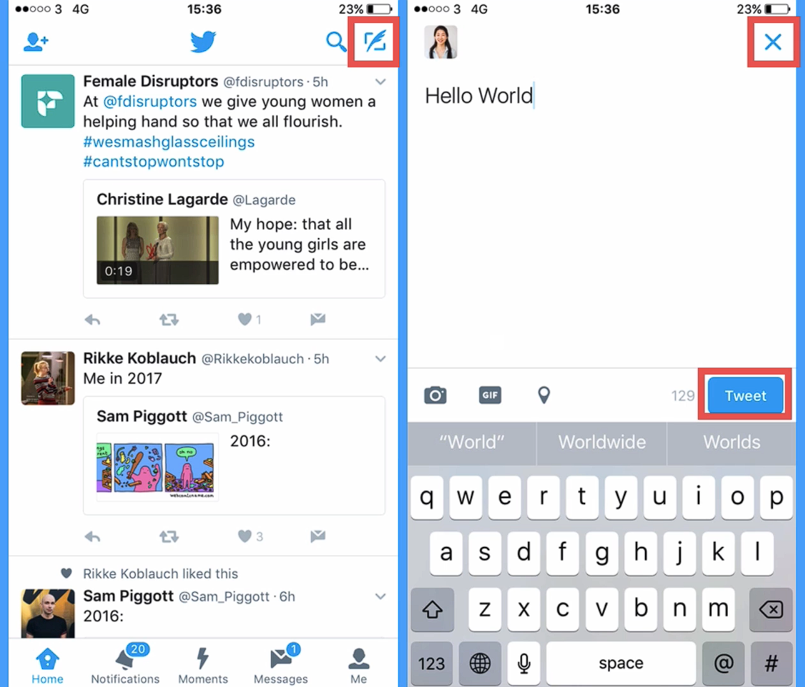
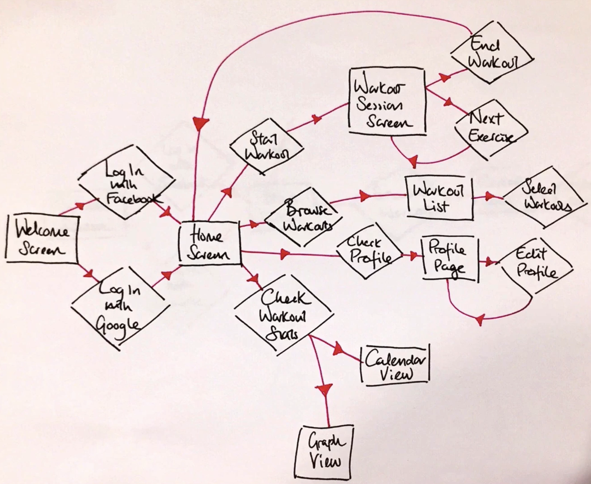
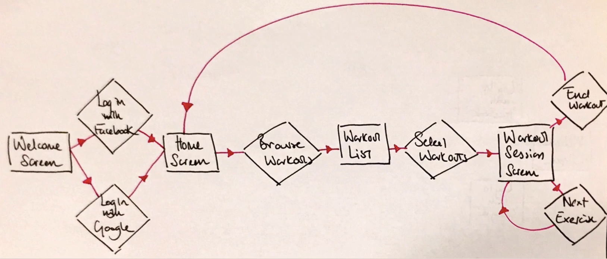

# Notes: How to Create a User Flow Diagram

## What is a User Flow Diagram?

* A **user flow diagram** is a high-level visual representation of a user's journey through an app or website.
* It helps designers plan how users move between screens and complete tasks.
* Similar to a **website sitemap**, but focuses on user interactions.

### Components of a User Flow Diagram

1. **Rectangles** → Represent **screens** (e.g., Home, Login, Compose).
2. **Diamonds** → Represent **user decisions/actions** (e.g., Login, New Tweet, Cancel).
3. **Arrows** → Connect screens and actions to show the user's path.

  

### Example: Twitter User Flow

1. User opens **Feed Screen**.
2. Taps **New Tweet** button.
3. Moves to **Compose Screen**.
4. User chooses to:

   * **Cancel** → Returns to Feed.
   * **Tweet** → Sends the tweet.

  

---

## Workout App Example

### Main Flow

* Welcome Screen
* Login (Facebook or Google)
* Home Screen

From the Home Screen, users can:

* Start a workout
* Browse workouts
* View profile
* View workout statistics

  

### Best Practice

Instead of mapping the entire app, create a **separate user flow for one user journey**.

Example:

1. Welcome Screen
2. Login
3. Home Screen
4. Browse Workouts
5. Select Workout
6. Workout Session
7. Next Exercise or End Workout
8. Return Home

  

---

## Why Create User Flow Diagrams First?

### Advantages

* Easy and quick to modify.
* Helps identify better navigation before designing.
* Prevents expensive redesigns later.
* Saves time and money.

### Example

Adding a **"Start Default Workout"** button:

* In a user flow → Takes only a few seconds.
* In Photoshop → May take hours.
* In code → May take days.

---

## Importance of the Design Process

Skipping user flow planning often leads to:

* Building the wrong product.
* Expensive changes after design or development.
* Wasted time and development costs.

**Recommended workflow:**

1. User Flow Diagram
2. Wireframes
3. Visual Design (UI)
4. Coding/Development

---

## Challenge Exercise

Design a **Recipe App** user flow.

### App Features

* Browse recipes.
* Save/Favorite recipes for later.

**Task:** Draw a user flow diagram showing how a user navigates through these features.

---

## Key Takeaways

* User flow diagrams map how users interact with an app.
* Use:

  * **Rectangles** = Screens
  * **Diamonds** = Decisions/Actions
  * **Arrows** = Navigation
* Focus on **one user journey at a time**.
* Planning before designing or coding saves significant time, effort, and cost.
