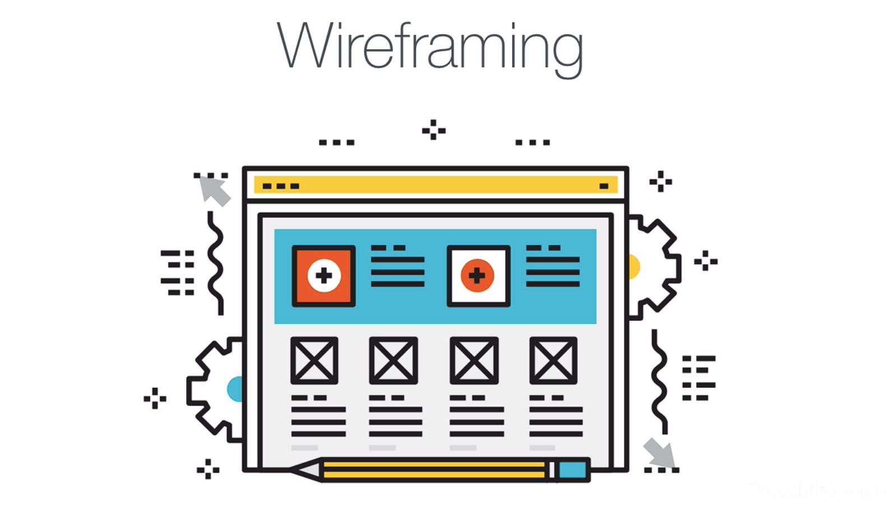
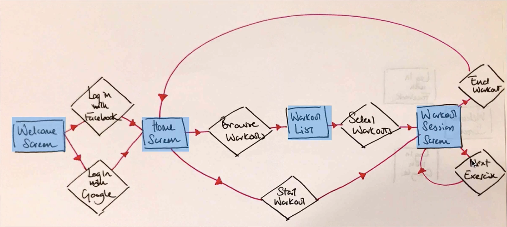
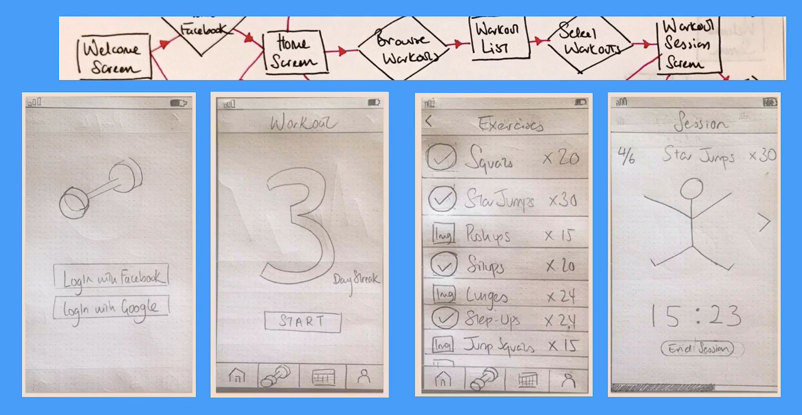

# Notes: How to Create Wireframes

## What Comes After User Flow?

* After completing the **user flow diagram**, the next step is **wireframing**.
* Wireframing helps transform user journeys into rough screen layouts.

---

## What is a Wireframe?

* A **wireframe** is a **low-fidelity (basic) representation** of an app's interface.
* It is usually created with **paper and pencil**.
* Shows:

  * Placement of images
  * Buttons
  * Navigation
  * Overall screen layout
* Focuses on **structure**, not visual design.
* Should be **quick and rough** (around **10 screens in 20 minutes**).
* Drawing skills are **not important**.

  

### Purpose of Wireframing

* Clarifies how each screen will look.
* Helps prepare for:

  * High-fidelity mockups
  * Interactive prototypes
* Decides navigation elements such as:

  * Tab bars
  * Navigation controllers
  * Menus

### Recommended Wireframing Tools

#### UI Stencils

Provides:

* Stainless steel icon stencils
* Sketchpads with printed device templates (iPhone, Android, iPad, Website)
* Makes sketching faster.

**Bonus:** Free printable PDF templates are available.

---

## Converting User Flows into Wireframes

* Every **rectangle (screen)** in the user flow becomes a **wireframe**.
* Sketch every screen before moving to prototyping.

  

### Welcome Screen

* Background color
* Dumbbell image
* Login with Facebook button
* Login with Google button

### Home Screen

Shows:

* Workout streak message

  * Example: "You've had a 3-day streak."
* Start Workout button
* Bottom Tab Bar

### Workout List Screen

Contains:

* Exercise image
* Exercise name
* Number of repetitions
* Tap exercises to add them to workout

### Workout Session Screen

Displays:

* Exercise animation/image
* Number of sets
* Repetitions
* Workout timer
* Next Exercise button

  

---

## iOS vs Android Navigation

### iOS

Uses:

* Bottom Tab Bars
* Navigation Controllers

### Android

Usually uses:

* Hamburger Menu (☰)
* Avoids two rows of buttons because Android devices have physical/system navigation buttons.

**Key Idea:** Always follow platform-specific design guidelines.

---

## Prototyping with Pop App

**Pop** is a free app that converts paper wireframes into interactive prototypes.

### Process

1. Draw wireframes on paper.
2. Take photos of them.
3. Import into Pop.
4. Define clickable areas.
5. Link screens together.
6. Test the app like a real application.

Supports:

* Buttons
* Swipe gestures
* Navigation between screens

### Example Prototype Flow

1. Login
2. Home Screen
3. Browse workouts
4. Select exercises
5. Swipe to view more exercises
6. Start workout
7. Workout session
8. View statistics
9. Open profile
10. Return to Home

### Benefits of Wireframes & Prototypes

* Very quick to create (5–30 minutes).
* Turns ideas into something tangible.
* Easy to test before development.
* Helps communicate app ideas clearly.
* Makes it easier to gather feedback.

---

## Assignment

For the **Recipe App**:

1. Convert every screen in your **user flow diagram** into a **wireframe**.
2. Download the **Pop** app.
3. Photograph your sketches.
4. Link the screens using clickable areas.
5. Build a simple working prototype.
6. Share and test your prototype with others.

---

## Key Takeaways

* **User Flow → Wireframe → Prototype → Final App Design**
* Wireframes focus on **layout**, not appearance.
* Keep wireframes **simple, fast, and rough**.
* Follow **platform-specific design guidelines** (iOS vs Android).
* Interactive prototypes help explain and validate app ideas before development.
