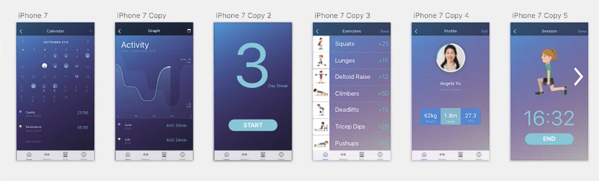

# Notes: How to use Sketch to Create Mockups

## 1. Getting Started

* Download a **30-day free trial** of Sketch from the official website.
* Sketch is **Mac-only**.
* Windows users can use **Canva** or **Marvel** for mockup prototyping instead.
* Open Sketch and select the **iOS UI Design** template.
* Save your project before starting.

---

## 2. Sketch Interface

### Main Areas

* **Toolbar:** Contains tools for drawing and editing vector graphics.
* **Left Panel:**

  * Pages
  * Symbols
* **Canvas:** Infinite workspace for designing.
* **Right Panel:** Properties, alignment, styling, and overrides.

---

## 3. Why Sketch?

* Built specifically for **UI/UX design**.
* Uses **vector graphics**, so designs remain sharp at any zoom level.
* Lightweight compared to Photoshop.
* Includes ready-made iOS UI components.

---

## 4. Pages

Use separate pages for different platforms:

* Website
* iOS App
* Android App

Create a new page:

* **File → New Page**
* Name it appropriately (e.g., *iOS App*).

---

## 5. Artboards

An **Artboard** represents one screen of your app.

To create:

* **Insert → Artboard**
* Select device (e.g., **iPhone 7**).

---

## 6. Using the iOS UI Template

The template includes:

* Status bars
* Navigation bars
* Keyboards
* Alerts
* Tab bars
* Other iOS interface elements

You can:

* Browse the template page.
* Copy and paste components.
* Or insert them directly through **Insert → Symbol**.

---

## 7. Symbols (Most Important Feature)

### What are Symbols?

Reusable UI components.

Examples:

* Navigation bars
* Buttons
* Icons
* Cards

### Benefits

* Design once.
* Reuse everywhere.
* Edit once → every instance updates automatically.

---

## 8. Overrides

Overrides let you customize individual symbol instances without changing the master symbol.

You can override:

* Text
* Images
* Labels
* Button titles

Example:
Same navigation bar symbol:

* Home Screen
* Workout Screen
* Settings

Each has different titles but shares the same design.

---

## 9. Designing a Screen

Typical workflow:

1. Add Status Bar
2. Add Navigation Bar
3. Add Background
4. Add Images
5. Add Buttons
6. Add Text
7. Align Elements

---

## 10. Creating Backgrounds

* Draw a rectangle covering the screen.
* Apply:

  * Solid colors
  * Gradients
* Adjust gradient direction by dragging the gradient line.
* Send the background behind other layers.

---

## 11. Working with Layers

Arrange objects by:

* Send to Back
* Bring to Front
* Reordering layers in the Layers panel

---

## 12. Creating Buttons

Steps:

1. Draw a rectangle.
2. Choose fill color.
3. Add text.
4. Round the corners using the Radius control.
5. Center-align text and shape.

---

## 13. Creating Your Own Symbol

After designing a button:

1. Select button + text.
2. Group them.
3. Click **Create Symbol**.
4. Give it a descriptive name.

Example:

* Red Button

Now it can be inserted into any screen.

---

## 14. Updating Symbols

If you edit the master symbol:

* Change color
* Shape
* Style

Every instance updates automatically.

---

## 15. Inserting Images

Use:

* **Insert → Image**

You can:

* Resize
* Move
* Layer images
* Align them with other UI elements

---

## 16. Alignment Tools

Sketch provides tools to:

* Center horizontally
* Center vertically
* Align left/right
* Align top/bottom
* Evenly distribute objects

---

## 17. Common Design Workflow

Most app screens are built by:

* Inserting symbols
* Customizing them with overrides
* Adjusting colors
* Adding images
* Aligning elements

Little drawing is required from scratch.

---

## 18. Editing Symbol Content

Overrides allow changing:

* Navigation titles
* Button labels
* Tab bar icons
* Images

Example:
Change:

* Blue placeholder icon
  → Home icon

Change:

* "Item"
  → "Home"

---

## 19. Free Sketch Resources

Useful resource:

* **Sketch App Sources**

Provides:

* UI kits
* Icons
* Templates
* Mobile layouts
* Vector graphics

Simply:

* Download
* Open the Sketch file
* Copy desired components into your own project

---

## 20. Advantages of Using Sketch

* Fast
* Lightweight
* Vector-based
* Designed specifically for UI/UX
* Excellent symbol system
* Reusable components
* Infinite canvas
* Easy alignment tools
* Large collection of free community resources

---

## Final Output

  

---

## Key Takeaways

* Sketch is optimized for UI design.
* Use **Artboards** for app screens.
* Use **Symbols** to create reusable components.
* Use **Overrides** to customize symbols without affecting the original.
* Build interfaces mainly by combining existing UI components rather than designing everything from scratch.
* Use gradients, images, and alignment tools to polish designs.
* Download free UI kits and templates to speed up the design process.
