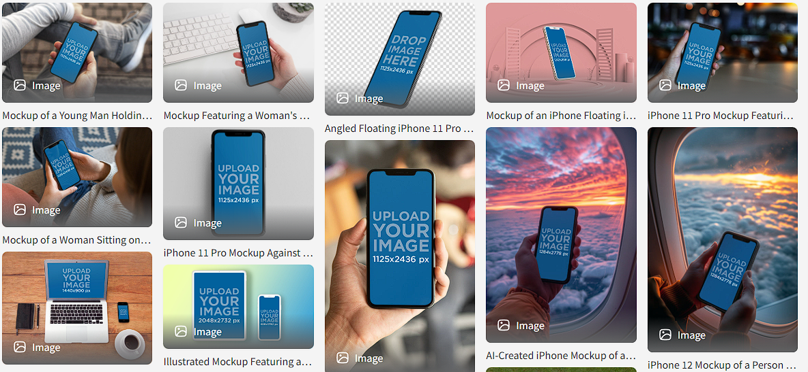

# Notes: Mockup Presentation + Assignment

## Mockup Presentation Tools

* **Placeit** (`www.placeit.net`)

  * Allows you to drag and drop app mockups into realistic product images (e.g., iPhones, people holding devices).
  * Great for showcasing apps in real-life scenarios.
  * Requires a paid subscription.

  

* **Sketch App Sources** (`www.sketchappsources.com`)

  * Free alternative for Sketch users.
  * Offers mockup templates where you can insert your app designs into device frames.

---

## Project Workflow - Recipe App (Assignment)

1. Create a **user flow diagram**.
2. Design **wireframes** using pencil and paper.
3. Convert wireframes into **high-fidelity (photorealistic) mockups** using design tools.

### Recommended Design Tools

* **If you have a Mac:**

  * Download the trial version of **Sketch 3**.
  * Practice the techniques taught in the module.
  * Create polished mockups using Sketch.

* **If you don't have a Mac or Sketch:**

  * Use **Canva** (covered in the previous lesson).
  * Explore other recommended design websites and tools provided in the course.

### Websites and Tools for Creating Designed Mockups (Alternatives to Sketch)

* Moqups - https://moqups.com/
* InVision App - https://www.invisionapp.com/
* UXpin - https://www.uxpin.com/

### Websites and Tools for Creating Real Life App Mockups

* Placeit - https://placeit.net/
* Magic Mockups - http://magicmockups.com/
* Smart Mockups - http://smartmockups.com/

---

## Key Takeaway

* The goal is to transform simple wireframes into **beautiful, realistic app mockups**.
* Choose the tool that fits your device and resources, then start building your recipe app mockup.
