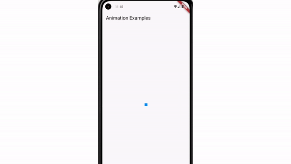

# Notes: How to Create an Animated App Prototype

## 1. Next Step After Mockups

* After creating **high-fidelity, photorealistic mockups**, the next stage is **prototyping**.
* A **prototype** is an animated, interactive version of a design.
* It demonstrates:

  * How the app looks
  * How it behaves
  * How users interact with it
* **No coding is required**—everything is done through design tools.

---

## 2. Popular Prototyping Tools

* **Marvel**

  * Easy to use.
  * Can create interactive prototypes.
  * Prototypes can be downloaded and tested on a phone.
* **InVision**

  * Main competitor to Marvel.
  * Similar features and user experience.
  * Offers a generous free tier.
* **Principle**

  * Mac-only application.
  * Similar interface to Sketch.
  * Specialized for UI prototyping.
  * Great for advanced animations.
* **Proto.io**

  * Another popular prototyping tool.
* **Instructor's preferred tools:**

  * **Principle** for advanced interactions.
  * **Marvel** for simple interactions.

---

## 3. How Principle Works

* Uses **tween animations**.
* **Tween animation**:

  * Define a starting state (position, size, etc.).
  * Define an ending state.
  * The software automatically creates all the intermediate animation frames.

### Tween Animation Example (Keynote)

* Create two slides:

  * Slide 1: Image in the bottom-left corner.
  * Slide 2: Same image moved to the bottom-right and slightly larger.
* Apply the **Magic Move** transition.
* Keynote automatically animates:

  * Movement
  * Size change
  * Intermediate frames
* This demonstrates the same animation principle used by many prototyping tools.

  

---

## Quick Summary

* **Workflow:** Mockups → Prototypes
* **Prototype:** Interactive, animated design without coding
* **Tools:** Marvel, InVision, Principle, Proto.io
* **Best for advanced animations:** Principle
* **Animation technique:** Tween animation (software generates frames between start and end states)
* **Bonus:** Keynote's **Magic Move** can create prototype-like animations.

---

## Key Takeaway

* Even **Keynote** can be used to build simple interactive prototypes.
* The next lesson focuses on creating prototypes using:

  * **Marvel**
  * **Keynote**
