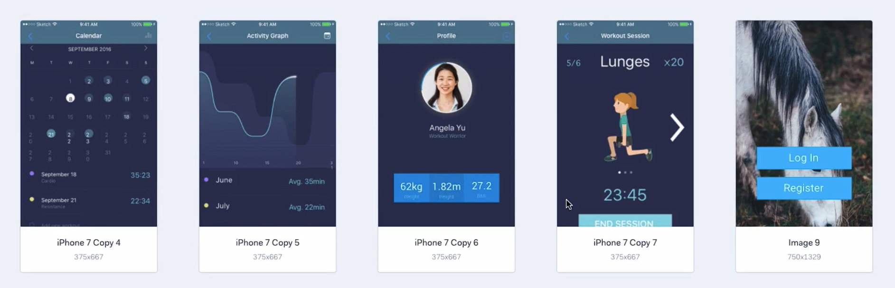

# Notes: Prototyping with Marvel

## What is Marvel App?

* **Marvel App** is a web-based prototyping tool.
* Website: **[www.marvelapp.com](http://www.marvelapp.com)**
* Free account allows you to create **up to 3 app prototypes**.

## Creating a New Project

1. Sign up for a free account.
2. Click **Create Project**.
3. Name the project (e.g., *Workout App*).
4. Choose a device size (e.g., **iPhone 6**).
5. Create the project.

## Using Marvel App

* Marvel provides **pre-designed screens** that you can drag into your project.
* Create interactive prototypes by:

  * Drawing **clickable/tappable areas (hotspots)**.
  * Linking each hotspot to another screen.
* Users can click through the prototype to simulate an app experience.

## Importing Designs from Sketch

* Download the **Marvel Sketch Plugin**.
* The plugin allows you to:

  * Export Sketch designs directly to Marvel.
  * Turn Sketch mockups into interactive prototypes quickly.
* After uploading:

  * Remove any default sample screens.
  * Add links between your own screens.

### Example Prototype Flow

* **Welcome Screen → Login → Home Screen**
* **Home → Start Workout → Workout Session**
* **End Session → Home**
* **Home → Workouts → Select Workout → Done → Workouts**
* **Home → Calendar View**
* Toggle between **Calendar** and **Graph** views.

## If You Don't Use Sketch

* You can upload mockups created in:

  * Canva
  * Photoshop
  * Any other design software
* Then link the uploaded screens together in Marvel.

## Designing Directly in Marvel

Marvel also includes a built-in design editor where you can:

* Create screens from scratch.
* Add:

  * Shapes
  * Text
  * Buttons
  * Images from Marvel's library
  * Your own custom images
* Customize colors, size, and layout.
* Add completed screens directly to your project and link them to other screens.

  

## Key Features

* Free and beginner-friendly.
* Interactive prototypes with clickable hotspots.
* Sketch plugin for easy importing.
* Supports images from multiple design tools.
* Built-in screen editor for creating simple mockups.
* Easy navigation between linked screens.

## Key Takeaway

**Marvel App is a simple prototyping tool that lets you create interactive app prototypes by importing mockups or designing screens directly within the app, then connecting them with clickable interactions.**
