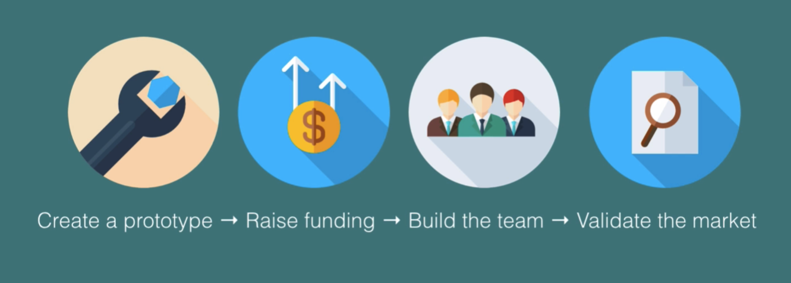
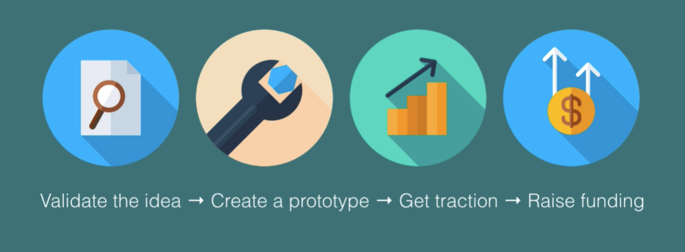

# Notes: Importance of Idea Validation (Research Phase for Startup or App)

## What is Idea Validation?

* Idea validation is the process of testing whether an app or startup idea is worth investing time, money, and effort into.
* It helps determine if real users actually want the product before building it.

### Why Idea Validation Matters

* Most people dream of overnight success, but this is rare.
* Media focuses on success stories and public failures, creating a biased perception.
* The reality: most startups fail quietly because no one notices them.
* Validating ideas increases the chances of building something people actually want.

---

## Time is Your Most Valuable Resource

* Time is non-renewable and more valuable than money.
* Spending months or years on a bad idea means missing opportunities to work on better ones.
* Validation helps save both time and money.

  

---

## Having Ideas Isn't Enough

* Entrepreneurs often have many ideas.
* The challenge is identifying which ideas are worth pursuing.
* Validation provides feedback from potential customers before major investment.

### Example of a Bad Idea

* The Silicon Valley TV show illustrates people spending years on unnecessary apps.
* A common mistake is building products that don't solve real problems.
* The issue isn't creativity—it's failing to validate the idea with real users.

---

## Successful Founders Reduce Risk

* Successful entrepreneurs don't simply take huge risks.
* They actively reduce uncertainty before committing resources.
* Example: Richard Branson arranged to return Virgin Atlantic's plane if the business failed after a year.
* Great founders manage risk instead of gambling.

### Timing Matters

* Even good ideas can fail if the market isn't ready.
* Example:

  * Palm Pilot failed to achieve the success of the iPhone.
  * The difference was timing and market conditions, not just the idea.

---

## Two Startup Paths

### Less Effective Approach

1. Build a prototype.
2. Raise funding.
3. Build a team.
4. Launch product.
5. Hope for success.

  

### Better Approach

1. Validate the idea with real users.
2. Confirm people are willing to use or download it.
3. Build a prototype.
4. Show traction (user growth, engagement, etc.).
5. Raise funding using evidence.
6. Continue growing the product.

  

---

## Key Takeaways

* Validate before you build.
* Test ideas with real customers.
* Reduce risk through research and feedback.
* Use evidence and traction to attract investors.
* The goal is to build something people genuinely need, not just something that seems like a good idea.
