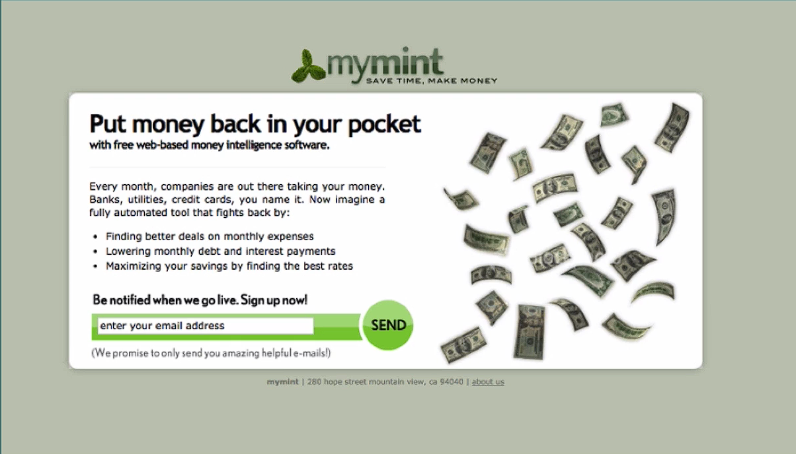
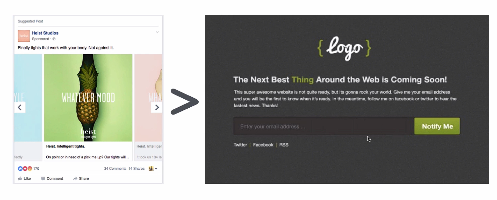

# Notes: Validating a Startup Idea with a Landing Page

## Why Use a Landing Page?

* A **landing page** is one of the best ways to validate a business idea **before building the product**.
* It usually includes:

  * A clear headline explaining the product.
  * A short description of the benefits.
  * An **email sign-up form** ("Be notified when we go live").

  

* Purpose:

  * Measure real interest.
  * Build a list of potential customers.
  * Avoid wasting time and money on products people don't want.

---

## Benefits of Landing Page Validation

* Confirms whether people are genuinely interested.
* Requires little investment (before coding or manufacturing).
* Creates an audience ready for launch.
* Reduces startup risk by relying on data instead of assumptions.

---

## How to Validate an Idea

### Step 1: Create a Simple Landing Page

Include:

* Product name/branding.
* Brief explanation of what problem it solves.
* Email collection form.

  

### Step 2: Drive Traffic

Use:

* **Facebook Ads**
* **Google Ads (AdWords)**

Goal:

* Send visitors to the landing page.
* Measure how many people sign up.

---

## Facebook Ads

### Advantages

* Highly targeted audiences based on:

  * Age
  * Gender
  * Interests
  * Relationship status
  * Behavior

Example:

* Wedding photographers can target **recently engaged** users.

### Important Metrics

* **Reach** = Number of people who saw the ad.
* **Engagement** = Likes, comments, pauses, clicks, etc.
* **Click-through rate (CTR)** = Percentage of people who clicked.
* **Conversion rate** = Percentage who signed up after clicking.

### Tips

* Use **automatic bidding**.
* Test **10–20 different ads**.
* Experiment with:

  * Images
  * Headlines
  * Button text ("Find Out More" vs. "Buy Now")
* Continuously improve based on performance.

---

## Google Ads

### Advantages

* Targets users based on **search intent**.
* Best when people are actively searching for solutions.

### Keyword Tip

Focus on the **desired outcome**, not the product.

Example:
Instead of:

* Exercise app

Use keywords like:

* Weight loss
* Build muscle
* Get fit

---

## Understanding the Marketing Funnel

### Funnel Stages

1. **Impressions** – People see the ad.
2. **Clicks** – People visit the landing page.
3. **Sign-ups** – People leave their email.

### Interpretation

High impressions → High clicks
= Attractive ad

High clicks → High sign-ups
= Strong interest in the actual product

---

## Budget Recommendations

* Around **$100** is enough to collect useful validation data.
* Suggested setup:

  * Budget: **$20/day**
  * Automatic bidding
  * Start with **$0.50 per click**
  * Increase by **$0.25** if necessary until clicks begin.

---

## Stronger Validation: "Buy Now" Test

Instead of asking for an email:

* Add a **"Buy Now"** button.

When users click:

* Tell them the product is:

  * Out of stock
  * In beta
  * Coming soon

Then ask for their email.

### Why It Works

People who click **Buy Now** show:

* Higher purchase intent.
* Greater commitment than someone simply joining an email list.

This provides **better validation** than email sign-ups alone.

### Psychology Behind It

People prefer to remain **consistent** with their previous actions.

If they click **Buy Now**, they are more likely to:

* Enter their email afterward.
* Return when the product launches.

---

## Facebook vs. Google Ads

### Facebook

Best for:

* Demographic targeting.
* Interest-based products.

### Google

Best for:

* Capturing users actively searching for a solution.
* Search-intent marketing.

Choose the platform based on your product and audience.

---

## Key Lessons

* **Always validate before building.**
* Base decisions on **data**, not intuition.
* Test multiple ads and improve them iteratively.
* High landing-page conversion indicates genuine market demand.
* People willing to click **Buy Now** provide stronger validation than email sign-ups.
* Spending a small amount on validation can save months of work and significant investment.

---

## Final Takeaway

> **Always validate your idea before investing substantial time or money.** A simple landing page combined with targeted ads can reveal whether there is real demand, significantly increasing your chances of building a successful product.
