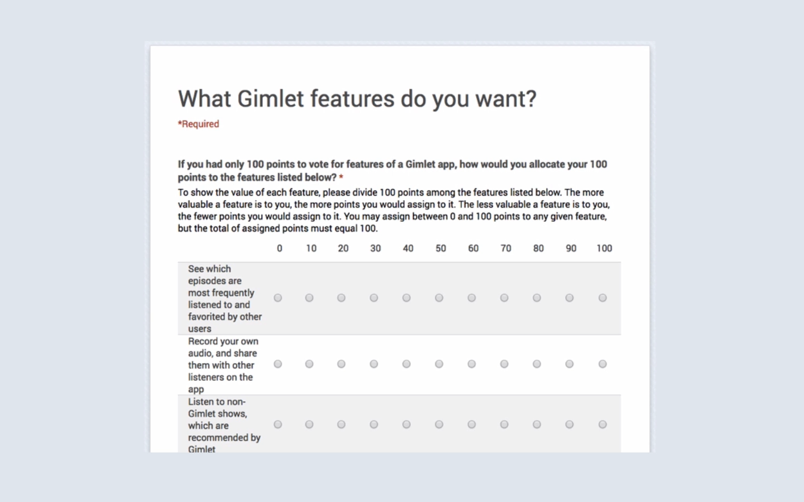

# Notes: Creating a Minimum Viable Product 

## 1. What to do after validating interest

* After a landing page proves people are interested, **don't immediately build the full product**.
* Avoid spending large amounts of money or months of development without further validation.
* Instead, create a **Minimum Viable Product (MVP)**.

---

## 2. What is an MVP?

* A **Minimum Viable Product (MVP)** is the simplest version of a product that tests the core idea.
* Based on the **Lean Startup** methodology:

  * Don't assume what users want.
  * Let real user feedback guide development.

### Example: Great Little Place

* Initial step: Created a landing page to collect email sign-ups.
* Next step: Built a simple **Facebook page** instead of an app.
* Used the Facebook page to:

  * Share local discoveries.
  * Encourage community contributions.
  * Measure engagement (likes, comments, followers, posts).
* User requests (e.g., "Do you have an Apple or Android app?") helped validate demand and prioritize features.

### Example: Jamie App

* Goal: Connect startup professionals for 30-minute meetings.
* Despite its name, **it had no app initially**.
* MVP process:

  * Send a weekly email asking for availability.
  * Match interested users manually.
* Benefits:

  * No infrastructure or development costs.
  * Validated demand before investing in a real app.
  * Built tens of thousands of users.
  * Used traction to attract investors.

---

## 3. Why build an MVP?

* Reduces time, cost, and risk.
* Confirms whether people actually use the product.
* Provides real user feedback.
* Demonstrates traction to investors (VCs, angel investors).
* Helps identify which features matter most.

---

## 4. How to find your core product

* List every feature you want.
* Remove features one by one.
* Keep asking:

  * "Would you still use this?"
  * "Would you still buy this?"
* The smallest version people still value is your **core product**.
* Build your MVP around that.

---

## 5. Measure MVP success

Track:

* Email sign-ups
* Weekly user growth
* User engagement
* Community activity
* Requests for new features
* Overall traction

### Example: Gimlet Media

* Created a **5-minute narrated prototype video** instead of building an app.
* Showed it to podcast listeners.
* Collected feedback through a Google Form.
* Asked:

  * Which features are useful?
  * Is an app even necessary?
  * What improvements should be made?
* Used feedback before investing in development.

  

---

## Key Takeaways

* Validate demand before building.
* Start with the simplest possible version of your idea.
* Let user feedback shape future development.
* Focus on solving **one core problem** well.
* Build only after you've demonstrated real traction.
