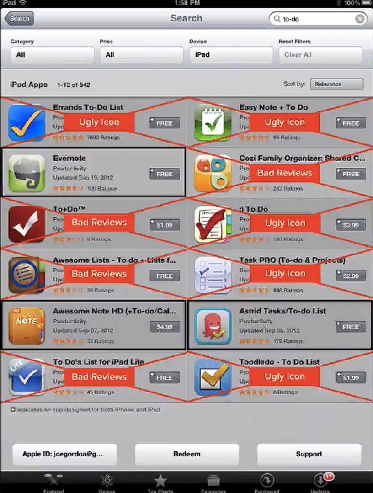
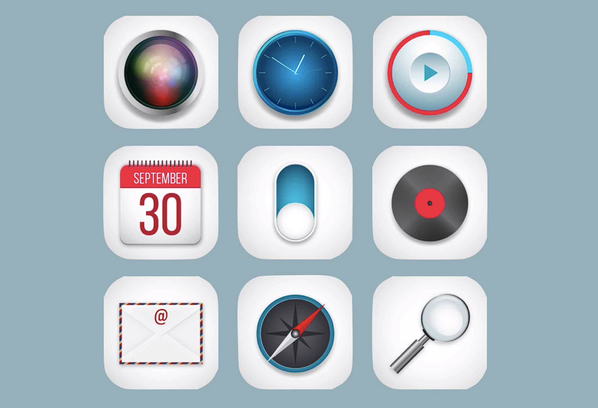

# Notes: App Listing Optimization and App Icon

## What is an App Listing?

* The app listing is what users see after searching for an app in the App Store.
* It typically includes:

  * App icon
  * App name
  * Ratings and reviews
  * Screenshots

### Importance of Design

* First impressions matter.
* Users often decide which apps to consider based on:

  * Attractive app icon
  * Good screenshots
  * Positive ratings
* A well-designed app is more likely to stand out among competitors.

  

---

## Creating a Great App Icon

If you're not a designer, you can hire freelance designers.

  

### Option 1: Fiverr

* Offers affordable freelance services (starting around **$5**).
* Many designers create professional app icons.

**Things to watch out for:**

* Ensure the design includes **commercial usage rights** (may cost extra).
* Get confirmation in writing if commercial rights aren't clearly stated.
* Quality varies between designers.

  * Hire multiple designers (around **5–6**) to increase your chances of getting a good design.
* Check originality.

  * Perform a **reverse Google Image search** to ensure the design isn't copied from another source.

**Pros:**

* Very affordable.
* Large selection of designers.

**Cons:**

* Inconsistent quality.
* Risk of copied artwork.
* Commercial rights may require extra payment.

### Option 2: 99designs

* Uses a **design contest** model.
* You post your project requirements.
* Multiple designers submit design concepts.
* You only pay if you choose a design you like.

**Pros:**

* See many design options before paying.
* No payment if none of the designs meet your expectations.
* Lower risk compared to hiring multiple freelancers individually.

---

## Key Takeaways

* Design strongly influences whether users download your app.
* Invest in a professional, attractive app icon.
* When using Fiverr:

  * Verify commercial rights.
  * Hire multiple designers.
  * Check designs for originality.
* **99designs** offers a safer alternative by allowing you to review multiple designs before making a payment.
