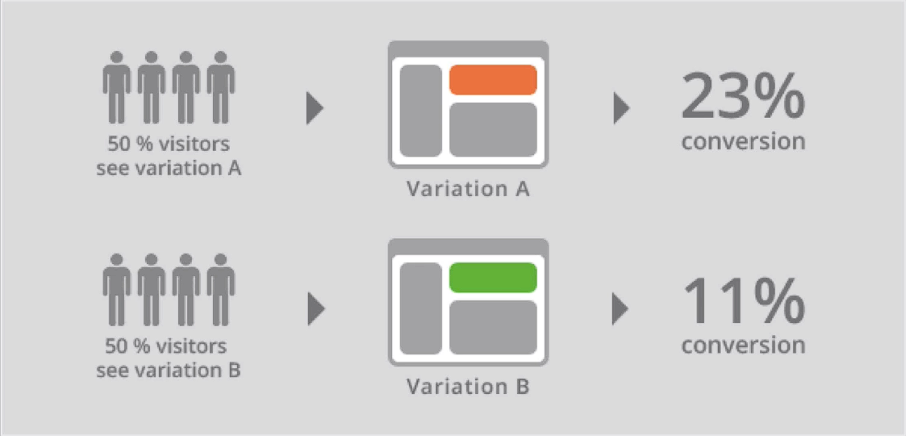
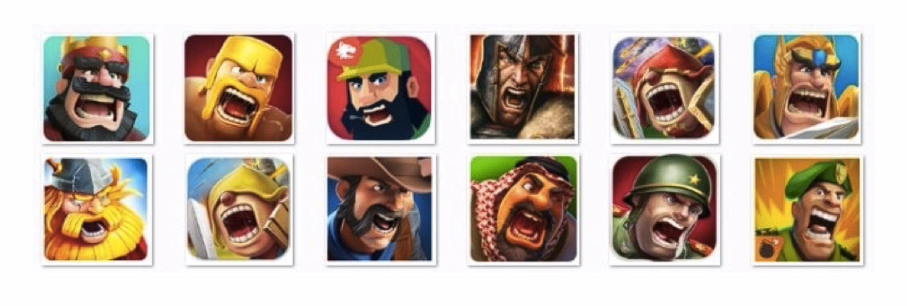
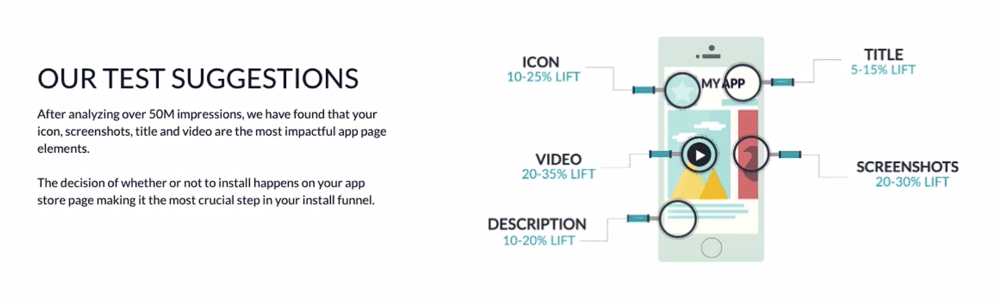

# Notes: App Icon Split Testing & App Store Optimization

## 1. Create Multiple App Icons

* Don't ask a designer for just **one app icon**.
* Request **5–6 variations** with small design differences.
* Multiple options allow you to test which icon performs best.

---

## 2. What is A/B Split Testing?

* Show different icon versions to different users:

  * **50%** see Icon A.
  * **50%** see Icon B.
* Compare **conversion rates (downloads)**.
* Choose the highest-performing icon.
* Create small improvements ("micro-variations") of the winning icon and test again.
* Repeat until you find the most effective design.

  

### Marketing is About Experimentation

* Assumptions don't matter as much as **real user data**.
* Test ideas with actual users.
* Focus on what increases:

  * Downloads
  * Conversions
  * Revenue

---

## 3. Google Play Split Testing

* Google Play makes A/B testing easy.
* Upload multiple app icons.
* Google automatically shows different icons to different users.
* Performance data reveals which icon generates the most downloads.
* The best-performing icon is often **not the one that looks the nicest**.

---

## 4. Psychology of Successful App Icons

* Many top strategy games use similar icon designs:

  * Main character's face
  * Mouth open (shouting/action expression)
  * Looking into the distance

  

* Possible reasons:

  * Human faces naturally attract attention.
  * Emotional expressions increase engagement.
  * Directional gaze creates curiosity.
* Popular games inspired many copycats, but these designs were likely validated through extensive testing.

---

## 5. iOS App Store Limitations

* Apple does **not** provide built-in A/B testing for app icons.
* Developers must:

  * Update the app manually.
  * Compare performance over different time periods.

### Problems with this approach:

* Comparisons aren't scientifically reliable because many factors change over time (e.g., promotions, featured placements).
* App updates require review, delaying experiments.
* Review times average around **4 days**, limiting how many tests can be run.

---

## 6. Alternative: StoreMaven

* StoreMaven creates a page that looks like the App Store.
* Users interact with this page before reaching the real store.
* Allows testing of:

  * App icons
  * Screenshots
  * Descriptions
* **Pros:**

  * Detailed optimization data.
  * Faster experimentation than waiting for App Store updates.
* **Cons:**

  * Adds one extra click, which may reduce some downloads.
  * Offers a **30-day free trial**.

  

---

## Key Takeaways

* Always design **multiple icon variations**.
* Use **A/B testing** to optimize downloads.
* Let **data guide design decisions**, not personal preference.
* Google Play supports easy split testing; iOS requires workarounds.
* Continuous testing and refinement lead to better app conversion rates.
