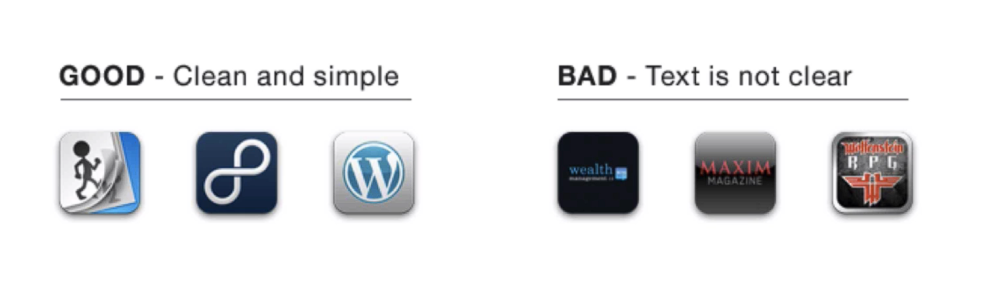

## Notes: What Makes a Good App Icon?

* **Avoid using text** in your app icon.

  * Text does not scale well on smaller screens (e.g., Apple Watch, older iPhones).
  * If users can't read it, it adds no value.

* **Keep the design simple and clean.**

  * Focus on a minimal, uncluttered design.
  * Simplicity improves recognition at any size.

  

* **Make it iconic and memorable.**

  * Create a unique visual identity.
  * Users should recognize the app by its:

    * Shape
    * Colors
    * Overall design

* **Think of it like a logo.**

  * A good app icon should represent the brand.
  * It should be instantly recognizable even without the app's name.

## Key Takeaway

A great app icon is **text-free, simple, scalable, memorable, and representative of the brand**, allowing users to recognize it instantly at any size.
