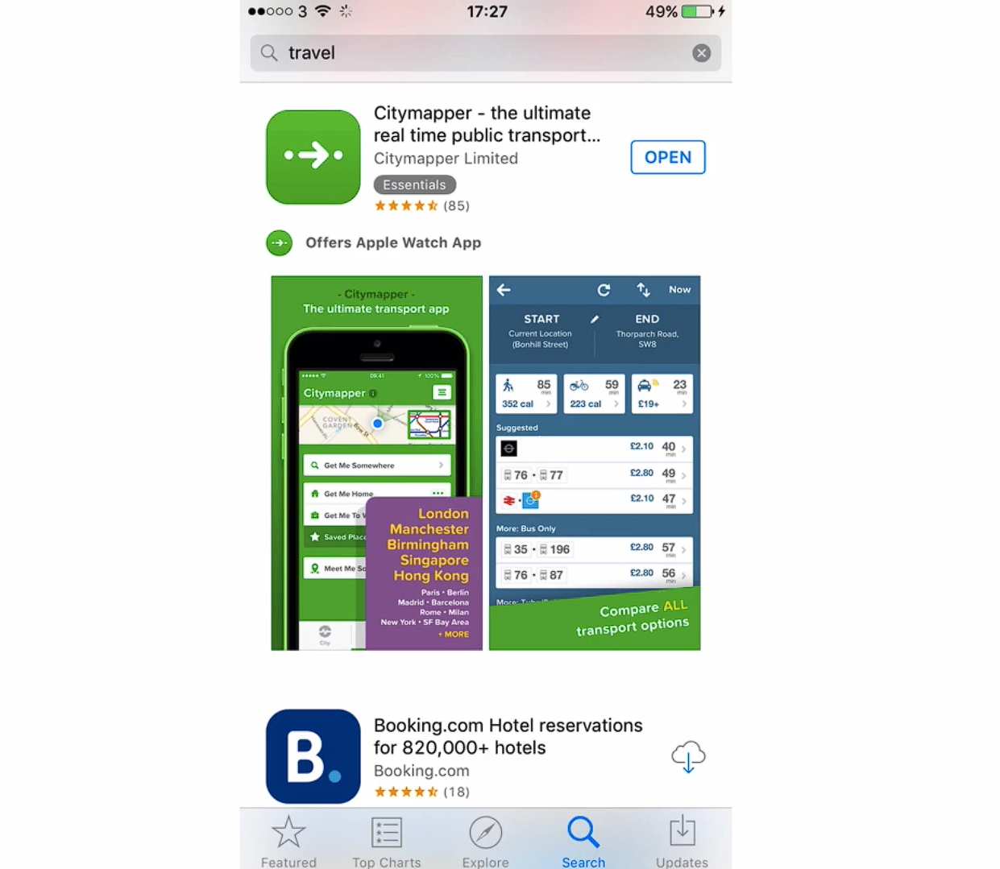

# Notes: App Store Screenshots

## Why Screenshots Matter

* Screenshots take up about **two-thirds of the App Store listing**, making them one of the most important elements.
* Users usually **browse quickly**, so screenshots should immediately grab attention.

  

### Three Screenshot Strategies

1. **Basic screenshots**

   * Show the app in use.
   * Rely on users understanding the app from the images alone.

2. **Screenshots with short captions**

   * Add a brief sentence or two explaining the feature.
   * Helps communicate the app's value more clearly.

3. **Fully designed screenshots**

   * Professionally designed layouts.
   * Combine screenshots, graphics, and short explanatory text.
   * Highlight key features and what makes the app different from competitors.

> **Tip:** Choose the approach based on your **budget** and **available time**.

### How to Create Effective Screenshots

* There is **no universal design**—the best screenshots depend on your app.
* Use **A/B (split) testing** to compare different screenshot designs and find which ones increase downloads.

---

## Common Mistakes to Avoid

* **Don't use stock photos.**

  * They often look generic and make the app seem low quality.

* **Don't overload screenshots with text.**

  * Keep text to **one short phrase or at most two sentences**.
  * The screenshot should remain the main focus.

* **Use engaging visuals.**

  * Faces and strong visual elements attract more attention than long descriptions.

* **Maintain high image quality.**

  * Avoid pixelated images.
  * Use correctly sized graphics.
  * Ensure edited images are professionally cut out and polished.

---

## Key Takeaway

* App screenshots are a major factor in attracting users.
* Keep them **visual, clean, high-quality, and concise**.
* Test different designs to discover what best persuades users to download your app.
