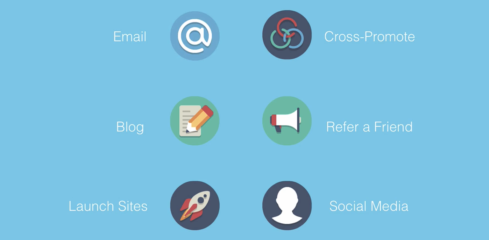

# Notes: Getting the First 1,000 Customers

## Main Idea

* The **first 1,000 customers** are the most important for any startup or new product.
* They are the early believers who trust your vision before your brand has a reputation.

### Why the First 1,000 Customers Matter

* After reaching around 1,000 customers, growth becomes easier through:

  * Word-of-mouth referrals
  * Better search engine rankings (Google)
  * Increased credibility and reputation
* The early stage is the hardest because startups usually have:

  * No reputation
  * Limited marketing budget
  * Little or no word-of-mouth
  * Poor visibility in search results

---

## The "1,000 True Fans" Concept

* Based on an article by **Kevin Kelly**.
* Success doesn't require millions of customers.
* Instead, you need about **1,000 loyal fans** who genuinely love your product and support your work.
* Loyal customers are more valuable than a large audience with little interest.

### Focus on Your Ideal Customers

* Don't try to make a product for everyone.
* Trying to please everyone often results in satisfying no one.
* Build something that delivers real value to a specific group of people.
* Treat customers well and continue providing value to build long-term loyalty.

### Marketing Philosophy

* Avoid focusing only on:

  * Clicks
  * Spam
  * Mass promotion
* Instead:

  * Create a valuable product.
  * Clearly demonstrate its value.
  * Keep improving and serving customers.
  * Business success follows by consistently providing value.

---

## What the Module Will Cover

The speaker will discuss **six underused marketing strategies** that:

* Help attract the first 1,000 customers.
* Apply not only to apps but also to many other types of businesses and products.
* Are based on lessons learned from personal startup experience.

  

---

## Key Takeaways

* The first 1,000 customers are the hardest—and most important—to acquire.
* Loyal fans matter more than a huge but disengaged audience.
* Focus on solving real problems for a specific target market.
* Sustainable growth comes from delivering value, not chasing clicks or broad appeal.
* Smart, customer-focused marketing is essential for launching a successful product.
