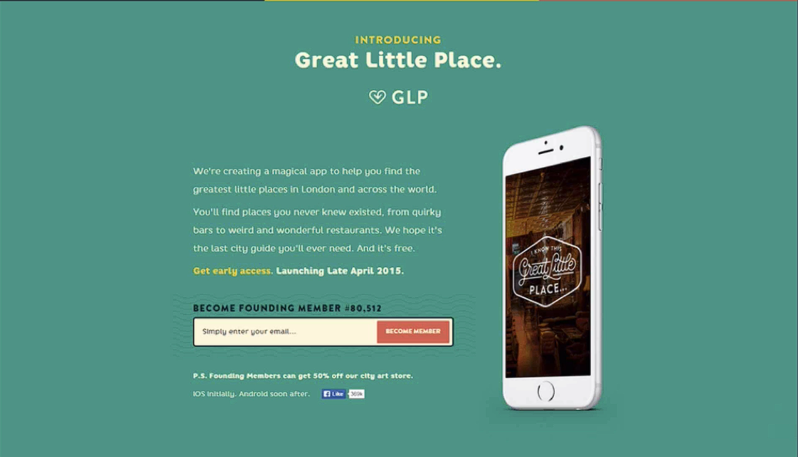
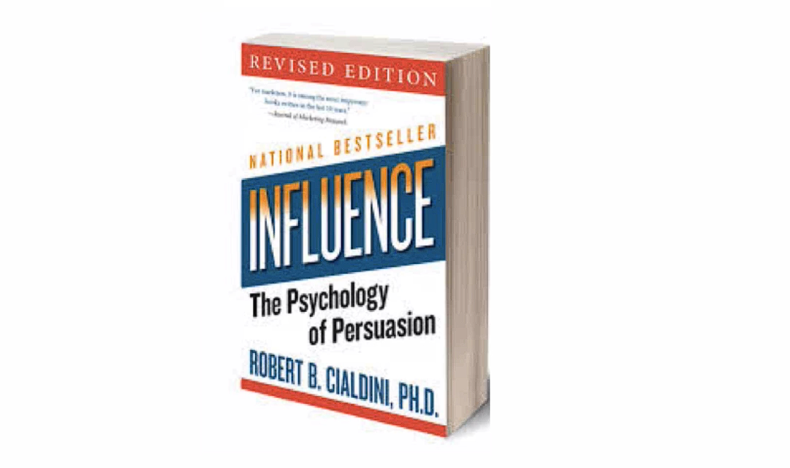
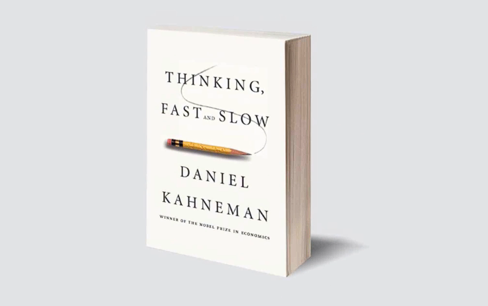
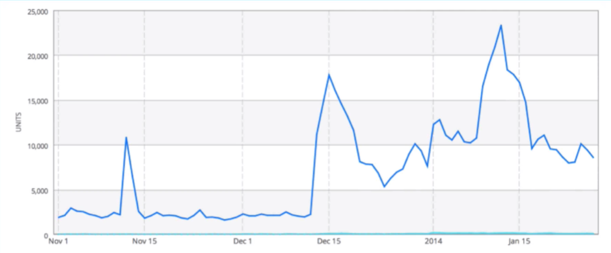

# Notes: The All Important Landing Page

## 1. Validate Your Idea Early

* Create a **product landing page** before building the full product.
* Include:

  * A clear explanation of the product.
  * An **email sign-up form** to collect interested users.
* Drive traffic using:

  * Facebook
  * Google Ads
  * Facebook groups
  * Slack communities
  * Other marketing channels

### Why collect emails?

* Build an audience before launch.
* On launch day, email subscribers to download the product.
* Emailing interested users is much more effective than relying on ads or forum posts after launch.

---

## 2. Social Proof

* Displaying a large number of sign-ups creates **social proof**.
* Example:

  * "Become founding member #80,512."
* People are more likely to trust something if many others appear interested.
* This is based on **herd mentality** (a cognitive bias).

  

### Case Study

* The founder of *Great Little Place* manually increased the displayed member count each day.
* Result:

  * Tens of thousands of email subscribers.
  * Large download spike on launch day.
  * Featured on the App Store.
  * Sustained growth in app rankings.

> **Key takeaway:** Build a landing page as early as possible ("yesterday" if possible).

---

## 3. Psychology in Marketing

Marketing works because people often make decisions using mental shortcuts (**heuristics**) rather than careful reasoning.

### Supermarket Examples

* Fresh fruit placed at the entrance → creates a healthy first impression.
* High-profit products placed at eye level → increases purchases.
* Bakery scents → stimulate hunger, leading to more impulse buying.

---

## 4. Recommended Books

### Robert Cialdini – *Influence*

* Explains how marketers use psychological principles to persuade people.

  

### Daniel Kahneman – *Thinking, Fast and Slow*

* Covers decision-making.
* Explains heuristics and cognitive biases.

  

---

## 5. Important Cognitive Biases

### Herd Mentality (Social Proof)

* People tend to follow what others are doing.
* Large numbers of users make a product seem more valuable and trustworthy.

### Consistency Bias

* People like their actions to match previous commitments.
* If someone signs up for updates, they're more likely to download the app later because they want to remain consistent.

---

## 6. Email Marketing Advantage

Instead of cold-emailing strangers:

1. User signs up on landing page.
2. User expresses interest.
3. On launch day, remind them:

   * "You wanted this app—it's now available."
4. This produces much higher conversion rates.

---

## 7. Launch Strategy

To maximize App Store success:

* Build a landing page early.
* Collect email subscribers.
* Drive targeted traffic to the page.
* Use email marketing to generate a strong download spike on launch day.
* Higher downloads increase the chance of being featured and gaining more visibility.

  

---

## Key Takeaways

* Validate ideas with a landing page before building.
* Start collecting emails as early as possible.
* Use social proof to increase trust.
* Understand cognitive biases (herd mentality and consistency bias).
* Email marketing is one of the most effective launch strategies.
* Strong launch-day downloads improve App Store rankings and visibility.
