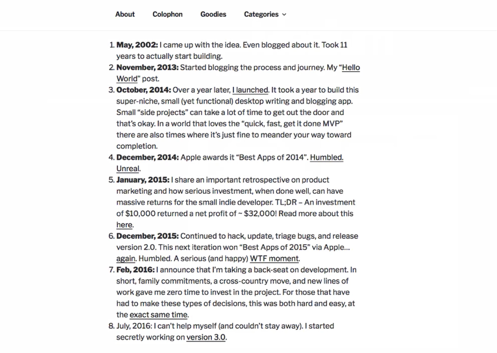
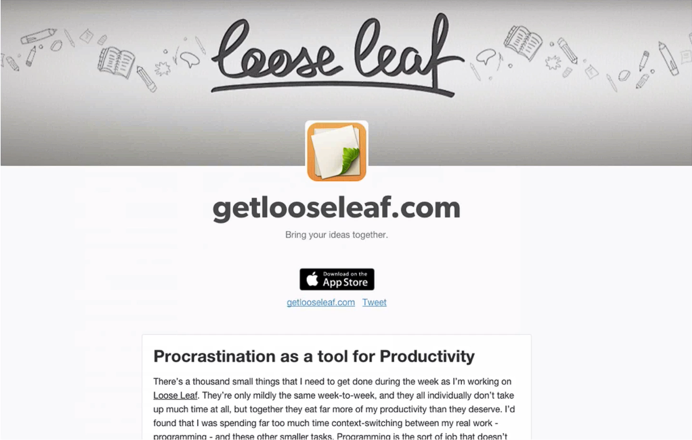

# Notes: Blogging as a Product Launch Strategy

## Why Blogging Matters

* Blogging is an **underused but highly effective** way to promote a product.
* It helps build awareness and creates a deeper connection with potential users.
* **Medium** is recommended because it is simple, minimalistic, and easy to use.

### What to Blog About

* Share the **entire journey** of building your product:

  * How the idea started.
  * Challenges faced.
  * Problems solved.
  * Progress and milestones.
* Storytelling keeps readers engaged because people naturally enjoy following a journey.

### Examples

* **Desk (Mac app):** Creator documented the app's development, even blogging about the idea years before launch.
* **Looseleaf:** Creator shared both technical and product-related challenges, attracting a loyal audience.

---

## Don't Fear Idea Theft

* Most people **won't act** on your idea even if they hear it.
* Success comes from **execution**, not just having an idea.
* If an idea is valuable, others are probably already working on something similar.
* Be transparent and focus on building your product rather than hiding the idea.

  

### Benefits of Blogging

* Builds a **loyal following**, not just a customer list.
* Followers become **true fans** who:

  * Care about your success.
  * Promote your product to others.
  * Support your journey.
* Fans are more emotionally invested than ordinary customers.

  

---

## Why Medium is Recommended

* Free and low effort to get started.
* No need to:

  * Buy a domain.
  * Set up hosting.
  * Install WordPress.
  * Customize themes or layouts.
* Simple editor with easy image uploads (drag and drop).
* Focus stays on **creating valuable content**, not managing a website.

---

## Key Takeaways

* Blog consistently about your product-building journey.
* Use storytelling to engage readers.
* Be open about your progress instead of worrying about idea theft.
* Build a community of fans before launch.
* Start with **Medium** because it's fast, simple, and lets you focus on content rather than website setup.
