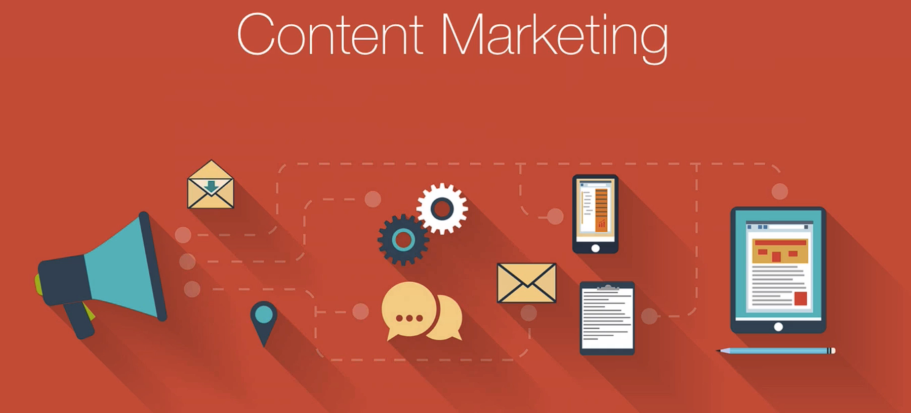

# Notes: Content Marketing Through Blogging

## What is Content Marketing?

* Create valuable, shareable content instead of directly promoting your product.
* Share useful knowledge, experiences, or "secret sauce" for free.
* The goal is to spread awareness of your message, app, or startup.

  

### Why It Works

* Helpful, interesting content is more likely to be shared than advertisements.
* Being transparent about your strategies builds trust and credibility.
* Even if you reveal your best tactics, few people will actually apply them successfully because execution still requires effort.

### Examples

* App creators like **Stuart Hall (7 Minute Workout)** and the **FitMenCook** team shared stories about their App Store success.
* They used:

  * Attention-grabbing, click-worthy titles.
  * Honest insights into their strategies and progress.

---

## Creating Effective Content

* Focus on topics that interest your target audience, not just your app.
* Example:

  * If you have a coffee app, write about:

    * Coffee gear reviews.
    * Brewing techniques.
    * Coffee-related experiences.
* The content should naturally attract the same audience that would use your product.

### Testing Content Ideas

* Start with short articles (around 500 words or less) with compelling titles.
* Measure engagement using platforms like Medium:

  * Number of readers.
  * Percentage of the article read.
* Expand successful topics into follow-up articles (Part 2, Part 3, etc.).

### Promoting Your Product

* Include a subtle mention or recommendation of your app within each article.
* This reaches the right audience without feeling like a direct advertisement.

---

## Key Takeaways

* Share valuable content instead of just asking people to download your app.
* Be open about your experiences and lessons learned.
* Write content that aligns with your audience's interests.
* Test ideas, analyze engagement, and build on successful topics.
* Start documenting your app-building journey as early as possible—even from the idea stage.
