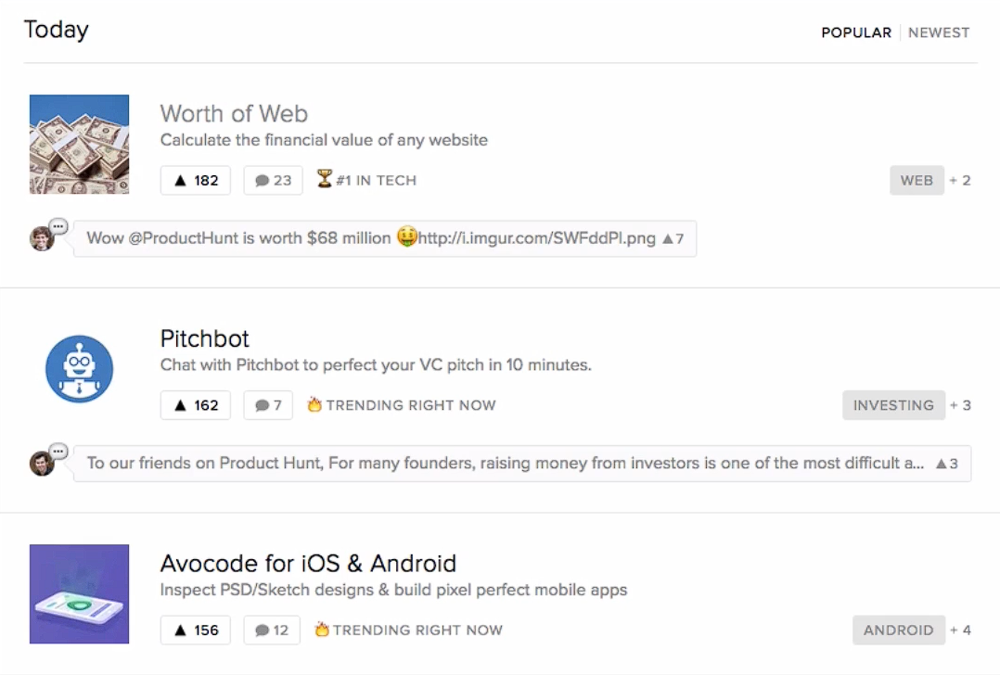
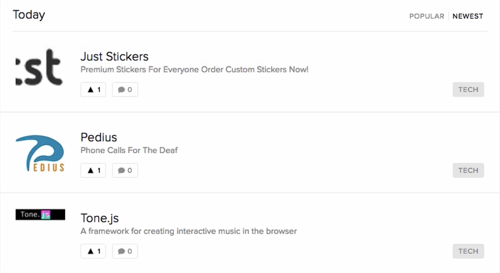

# Notes: How to Successfully Launch on Product Hunt

## Main Idea

* If you don't have a large audience of your own, you can **grow by leveraging someone else's audience**.
* One of the best platforms for tech products is **Product Hunt**.

---

## What is Product Hunt?

* A platform where people discover newly launched products.
* Products stay on the **front page for 24 hours** after being hunted.
* Higher upvotes and engagement lead to greater visibility.
* Audience includes:

  * Tech enthusiasts
  * Journalists
  * Tech bloggers
  * Venture capitalists (VCs)
  * Angel investors

### Why Product Hunt Matters

* Can generate **tens of thousands of visitors** in a single day.
* Top-performing products often gain additional exposure through:

  * Tech media (e.g., TechCrunch)
  * Product Hunt newsletters
  * Third-party APIs and newsletters that feature top products.
* A successful launch can result in:

  * Thousands of downloads or purchases
  * Increased credibility
  * Attention from investors and media

---

## Featured Page vs. Newest Page

### Featured Page

* Most users only browse the featured products.
* Products here receive the majority of traffic and exposure.

  

### Newest Hunts

* New submissions usually appear here first.
* Receives much less visibility.
* Harder to gain traction.

  

---

## Tips for a Successful Product Hunt Launch

### 1. Launch at the Right Time

* The Product Hunt day resets at **8:00 a.m. GMT**.
* Aim to launch around **8:01 a.m. GMT** to maximize the full 24-hour exposure.

### 2. Get an Influential Hunter

* Who hunts your product matters.
* Experienced or influential hunters can help your product reach the featured page.
* Contact them (usually via Twitter).
* Provide:

  * Name of the product (max 60 characters)
  * The URL you want to promote. If you have app URLs as well, put them here too
  * Tagline (max 60 characters)
  * The platforms your product runs on
  * Media - between 5 and 10 images showcasing different parts of your product. If you also have a YouTube video, that's perfect
  * Tell them what goodies you're preparing to give out to the Product Hunt community, if any

### 3. Find the Right Hunters

* Use the **Product Hunt Leaderboard**.
* Research:

  * Top hunters
  * Their interests
  * Products they've hunted previously
* Make a shortlist (20–30 relevant hunters) and reach out personally.

---

## Product Hunt Ranking Algorithm

* Rankings depend on more than just the number of upvotes.
* The algorithm evaluates:

  * Where votes come from
  * Quality of engagement
  * Discovery method

### Important Rule

* **Organic upvotes from the Product Hunt homepage carry more weight** than votes from shared links.

---

## What NOT to Do

Don't share your Product Hunt page asking people to upvote.

Reasons:

* Violates Product Hunt community guidelines.
* Can trigger the ranking algorithm.
* May reduce the value of your upvotes or cause your ranking to drop.

### Better Alternative

* Share a **search link** to your product instead of the direct Product Hunt page when appropriate.
* Encourage organic discovery rather than direct vote solicitation.

---

## Be Prepared Before Launch

* A Product Hunt launch is **one-time only** for a given product link.
* Once your product has been hunted, it cannot be hunted again using the same URL.
* Ensure everything is ready before launching.

---

## Key Takeaways

* Product Hunt is one of the most powerful launch platforms for tech products.
* Success depends on:

  * Launch timing
  * Influential hunters
  * Organic engagement
  * Following community guidelines
* Reaching the **Top 5** can lead to massive traffic, downloads, media attention, and investor interest.
