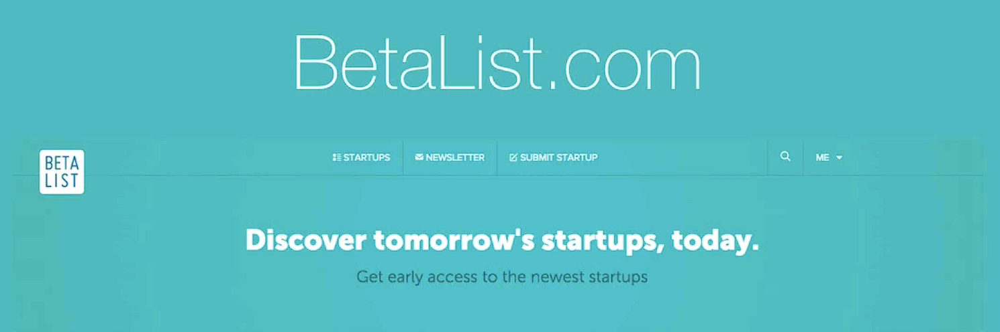

# Notes: BetaList – Product Launch Platform

## What is BetaList?

* A platform for **beta-stage (pre-launch) products**.
* Allows startups to submit their products before the official launch.
* Featured products are promoted through:

  * BetaList's email list
  * The BetaList website
* Audience includes:

  * Angel investors
  * Venture capitalists (VCs)
  * Early adopters
  * Other influential people in the startup ecosystem

  

### Popularity

* BetaList was launched **before Product Hunt**.
* It was initially very popular.
* Its popularity has gradually declined, especially after changes to its monetization model.

### Paid Queue System

* Due to the large number of submissions, BetaList introduced a **paid option** to skip the waiting queue.
* Cost is approximately **$200**.
* The speaker feels this is not always worth paying because results are uncertain.

---

## Traffic Compared to Product Hunt

| BetaList              | Product Hunt                                 |
| --------------------- | -------------------------------------------- |
| Thousands of visitors | Tens of thousands of visitors                |
| Smaller audience      | Much larger audience                         |
| Lower visibility      | Higher visibility and stronger launch impact |

---

## Critics

* Not a big fan of BetaList's current model.
* Believes paying to skip the queue may not provide enough return on investment (ROI).
* Suggests evaluating the platform yourself before deciding to use it.

---

## Key Takeaways

* BetaList is useful for promoting **pre-launch/beta products**.
* Can help gain visibility among investors and early adopters.
* Traffic is generally **lower than Product Hunt**.
* Consider whether the paid fast-track option is worth the cost before using it.
