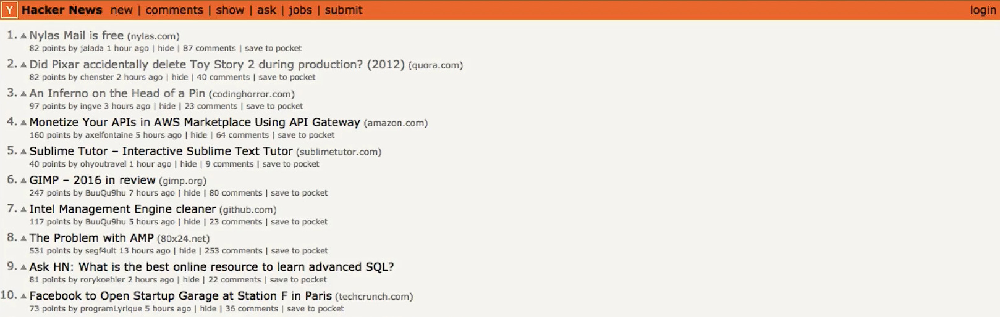

# Notes: Hacker News – Product Launch Platform

## What is Hacker News?

* A simple online forum hosted by **Y Combinator**.
* Primarily used by a **highly technical audience**.
* Popular among:

  * Software developers
  * Engineers
  * Startup founders
  * Tech professionals

  

### Audience

* More technical than Product Hunt or BetaList.
* Products with strong technical value or innovation tend to perform best.

---

## "Show HN" (Show Hacker News)

* A section where creators share:

  * Products
  * Projects
  * Apps
  * Code they've built
* Used to showcase new work and receive community feedback.

---

## Why Hacker News Matters

* Reaching the **front page (especially the Top 10)** can generate:

  * Massive traffic
  * Significant downloads
  * Strong visibility within the tech community

---

## Challenges of Launching on Hacker News

The ranking algorithm is **more difficult** than Product Hunt.

### Important Factors

* **Early momentum is critical.**

  * A product needs several upvotes within the **first hour**.
  * Without early engagement, the post is unlikely to gain visibility.
* **Upvotes should come from different IP addresses.**

  * Multiple votes from the same location (e.g., everyone in one office) are less effective.
* **Timing matters.**

  * Early activity strongly influences ranking.
* **Comments matter.**

  * Community discussion helps increase visibility.
* The algorithm is designed to prevent manipulation and vote cartels.

---

## Launch Strategy

* Submit your product to **Show HN**.
* Encourage a few trusted friends from different locations to engage with your post early.
* Once initial traction is established, rely on **organic community interest** rather than artificial promotion.

---

## Key Takeaways

* Hacker News is ideal for **technical products and developer-focused startups**.
* It has one of the **hardest ranking algorithms** among launch platforms.
* Success depends on:

  * Strong early upvotes
  * Genuine engagement
  * Comments and discussions
  * Organic interest
* A successful front-page appearance can lead to a large surge in traffic and product downloads.
