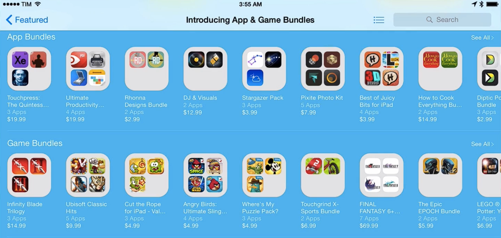

# Notes: Cross-Promotion Strategy

## What is Cross-Promotion?

* Two app developers agree to promote each other's apps.
* Goal: Each developer gains access to the other's user base, potentially increasing downloads and users.

  

### Why It Sounds Good

* Both developers can reach more people.
* In theory, both benefit by expanding their audience.

### Limitations

* In practice, cross-promotion often doesn't work as well as expected.
* Sending users to another developer's app may:

  * Pull users away from your own app.
  * Weaken the relationship you're building with your users.
  * Lead to less favorable long-term outcomes.

---

## Better Alternative

* Promote **your own apps** instead of someone else's.
* If you have multiple related apps (e.g., a meditation app and a workout app), recommend them to users within your apps.

  

### Benefits of Promoting Your Own Apps

* Keeps users within your own app ecosystem.
* Encourages users to discover more of your products.
* Strengthens your overall user base and retention.
* Generally produces better results than directing users to another developer's app.

---

## Key Takeaway

Cross-promotion with other developers may seem beneficial, but promoting your own related apps is usually a more effective strategy because it keeps users within your ecosystem and helps build stronger, long-term relationships.
