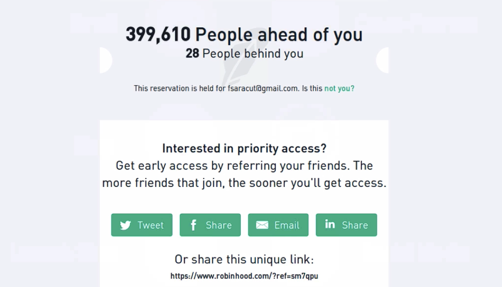

# Notes: Refer-a-Friend (Social Referrals) Strategy

## What is it?

* A **refer-a-friend** or **social referral** strategy encourages users to invite others in exchange for rewards (e.g., earlier access to a product).
* Case study: **Robinhood** used this tactic before launching its app.

## How Robinhood's System Worked

1. Users signed up with their email for **early access**.
2. After signing up, they saw their **position in a waiting queue** (e.g., 400,000 people ahead, 28 behind).
3. Users could **move up the queue** by referring friends.
4. Each successful referral improved their queue position.
5. Users received a unique referral link to share via social media or messaging.

  

---

### Why It Was Effective

* **Social proof:** Seeing hundreds of thousands of people already waiting made the app seem valuable and popular.
* **Scarcity & exclusivity:** Limited early access increased the app's perceived desirability.
* **Immediate gratification:** Users could instantly improve their queue position by taking action.
* **Network effect:** Each user invited others, creating exponential growth rather than relying only on paid advertising.

### Psychology Behind the Strategy

* People want things more when access is limited.
* Popular products appear more trustworthy and desirable.
* Offering an immediate reward (moving up the queue) motivates users to share quickly.

---

## Benefits

* Rapid email list growth.
* Low-cost user acquisition.
* Viral sharing through social networks.
* Strong pre-launch excitement and engagement.
* More scalable than relying solely on advertising.

### Implementation Tip

* A tool called **Maître** can help create referral-based waiting lists similar to Robinhood's system.
* This strategy is especially useful during the **pre-launch/build-up phase** to attract initial users before the product is released.

---

## Key Takeaway

A referral waiting list combines **social proof, scarcity, and rewards** to encourage users to invite others, generating viral growth and building a strong audience before launch.
