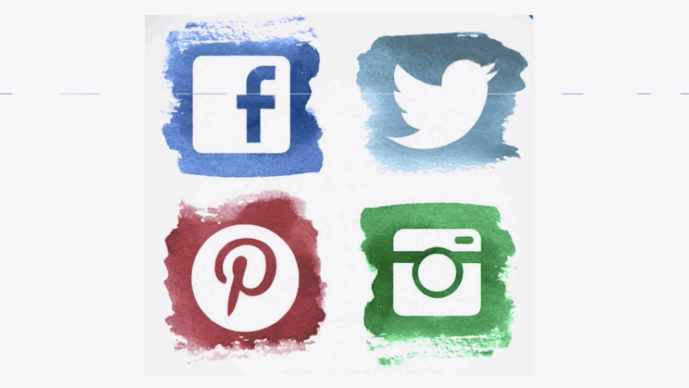

# Notes: Using Social Media to Your Advantage

## 1. Focus on the Right Platform

* Social media can consume unlimited time, so use it strategically.
* Identify where your target audience spends their time.
* Examples:

  * **Food products** → Instagram (highly visual)
  * **News apps** → Twitter (news-focused)
* Don't try to be active on every platform.
* Concentrate your efforts on **one primary platform** and do it well.

### Secure Your Social Media Handles

* Reserve your product/app name on the major platforms:

  * Facebook
  * Twitter
  * Instagram
  * Pinterest
* Even if you don't actively use them.
* This prevents "handle squatters" from claiming your name and selling it back at a high price.

  

---

## Let Your App Promote Itself

* Build sharing features directly into your app.
* Encourage users to share their experiences automatically.
* This reduces the amount of manual social media marketing required.

### Example: Viral Compatibility App

* Inspired by a popular article about **36 questions that build intimacy**.
* A simple app was created to:

  * Display questions for two users.
  * Show whose turn it is.
  * Include a 4-minute eye-contact timer.
  * Generate a compatibility score.

---

## Encourage Sharing Through Design

* The compatibility score was **randomly generated**.
* Scores were intentionally skewed toward:

  * Very low (0–10%)
  * Very high (90–100%)
* Extreme results made users more likely to share them on social media.

### Make Sharing Easy

* Include built-in **Share on Facebook** and **Share on Twitter** buttons.
* Pre-fill the shared post with:

  * The user's compatibility score.
  * A link to the app.
* Reducing friction increases sharing.

---

## Leverage the Network Effect

* Individual marketing reach is limited.
* If users share your app with their friends, who then share it further, your audience grows exponentially.
* Aim to automate social media promotion through user sharing rather than relying solely on your own marketing efforts.

---

## Key Takeaways

* Focus on **one social media platform** where your audience is most active.
* Secure your brand name across all major social networks.
* Design products with **built-in sharing features**.
* Encourage users to share by creating engaging, conversation-worthy experiences.
* Use the **network effect** to grow your audience organically.
