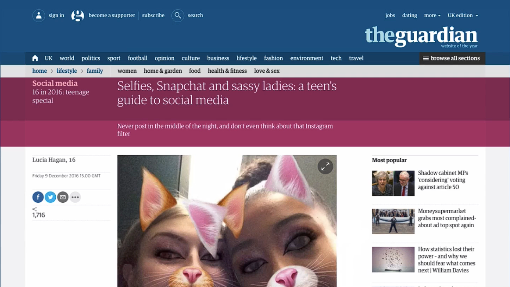

# Notes: Identify Your Target Audience for PR

## Know Your Audience

* Before seeking press coverage, identify **who your target audience is**.
* The value of media coverage depends on whether it reaches the right people.

### Choose the Right Media

* **Broad national coverage isn't always the best option.**
* Focus on publications and platforms where your audience already spends time.

### Examples

* **Teen-focused app:** A national newspaper like *The Guardian* may not significantly increase downloads.
* **Classical music app:** A publication like *The Guardian* may be a good fit.
* **Teacher-focused app:** A local or niche teacher publication is likely to generate better results than mainstream media.

  

---

## Key Takeaway

* **Target relevant media outlets, not just the biggest ones.**
* Reaching the right audience is more effective than getting the widest possible exposure.
