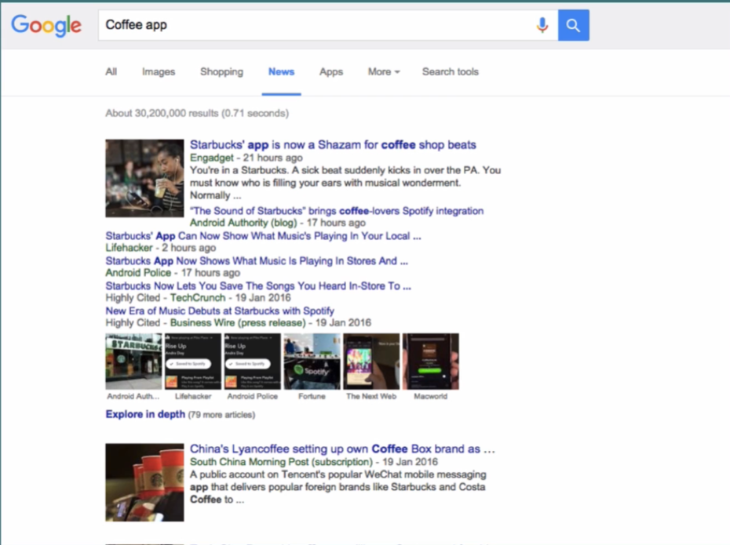
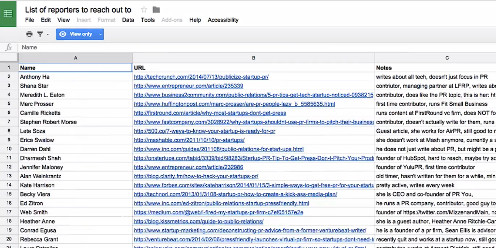

# Notes: Finding the Right Journalists to Pitch

## 1. Identify the Right People to Pitch

* After defining your story and creating a clear pitch, the next step is choosing **who to pitch**.
* Different journalists cover different topics (their **beat**), so target journalists whose interests match your niche.

---

## 2. Research Journalists

* Look at what journalists have written previously.
* Example:

  * If you have a **coffee app**, find journalists who have covered coffee apps or similar products.
  * Avoid pitching journalists who cover unrelated topics (e.g., fintech).

---

## 3. How to Find Relevant Journalists

* **Google News**

  * Search for your competitors or your niche.
  * Check the **News** tab.
  * Note the journalists who wrote those articles.

  

* **BuzzSumo** (advanced option)

  * Find journalists covering your niche.
  * See how much engagement their articles received.
  * Access additional useful insights.

  

---

## 4. Build a Journalist List

Create a spreadsheet with:

* Journalist's name
* Article URL
* Topic/niche covered
* Notes about their interests and writing style

  

---

## 5. Learn About Each Journalist

Research:

* Previous articles
* Twitter/X posts
* Facebook posts
* Topics they care about
* Opinions or perspectives on relevant issues

### Personalize Every Pitch

A good pitch should show that:

* You understand what the journalist covers.
* You're not wasting their time.
* You have a fresh idea, useful news, or valuable insight relevant to their audience.

### Why Personalization Matters

* Journalists receive pitches all day, every day.
* Generic mass emails are easy to ignore.
* Personalized, well-researched pitches have a much higher chance of getting a response.

---

## Key Takeaway

**Do your homework before pitching.** Research journalists, understand their interests, and send personalized pitches to people who genuinely cover your niche instead of emailing everyone indiscriminately.
