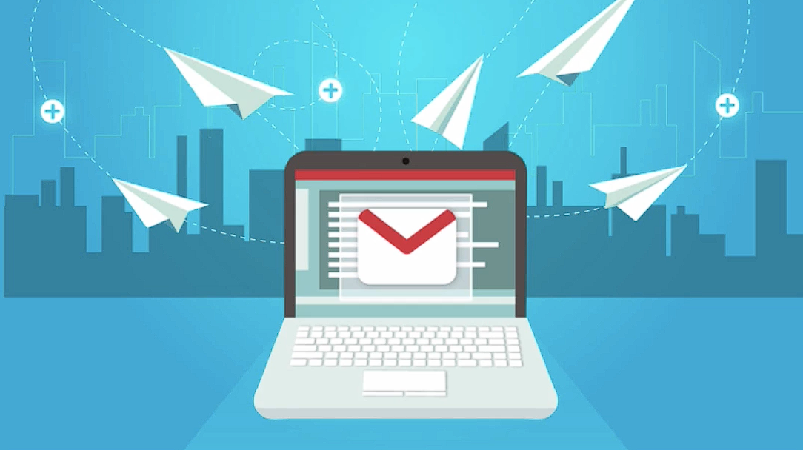
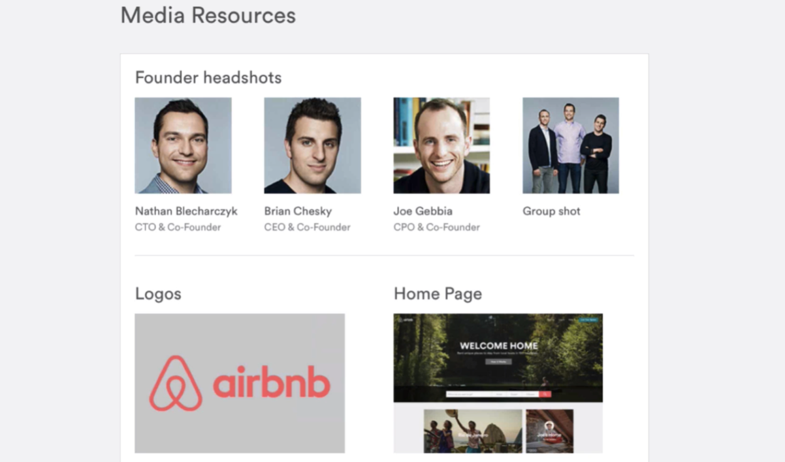

# Notes: Contacting Journalists Effectively

## 1. Best Way to Contact Journalists

* **Email is the preferred method.**
* Avoid:

  * Pitching on Twitter/X.
  * Spamming via direct messages.
  * Contacting through Facebook in a personal way.
* Keep emails:

  * **Body:** Under **200 words**.
  * **Subject line:** **40–60 characters**.
* Be **short, clear, and direct**.
* Include **links or attachments** for additional information.

<p align="center">
  
</p>

## 2. Use a Simple Pitch Template

* Make it:

  * Short.
  * Punchy.
  * To the point.
* Respect the journalist's time.
* Customize the template for your own needs.

```txt
Hey <First Name>,

My name is [first name] from [company name]. After reading your article 
{story.title} I thought your reader might be interested to hear more
about [topic from their article which relates to what you're pitching] since
the subject of [general topic from the article] has been in the news lately
as you've probably seen. Looking over your bio and past articles sounds
like you cover [topic from the article] a lot.

We developed a technology that... <insert your one sentence pitch
here>.

We have some <insert your news/study> which relates directly to your
interests and I wanted to shoot over info/details for you to review/check
out. Let me know if you'd be interested?

Thanks,
<Your full name>
<contact info>
```

## 3. Best Time to Send Emails

* Send emails **early in the journalist's workday**.
* Recommended time: **6:30–7:30 a.m.**
* Avoid sending late in the day (e.g., Friday afternoon), when emails are less likely to get attention.

### Research Journalists' Schedules

* Check a journalist's Twitter/X activity.
* Their first daily activity can indicate when they start work.
* Schedule emails to arrive around that time.

### Use Boomerang for Gmail

* Free Gmail plugin that lets you:

  * Schedule emails for future delivery.
  * Send emails according to the recipient's time zone.
* Useful for business and personal reminders.

## 4. Use Sidekick (HubSpot)

* Email tracking tool.
* Tracks when a recipient opens your email using an invisible tracking pixel.
* Helps determine whether:

  * The email was opened.
  * You should resend or rewrite the pitch if it wasn't opened.

## 5. Prepare a Press Kit Before Pitching

Include:

* Founder headshots.
* Company logos.
* Website screenshots.
* App screenshots (for apps).
* Product photos (for hardware/products).
* High-quality images and videos in multiple sizes/resolutions.

**Purpose:**

* Makes it easy for journalists to publish your story without requesting additional materials.

<p align="center">
  
</p>

### Share Press Kit Correctly

* Send the press kit as a **link** rather than a ZIP attachment.
* ZIP files are more likely to be blocked by spam filters.

## Key Takeaways

* Email is the best outreach method.
* Keep pitches brief, relevant, and professional.
* Send emails early in the morning.
* Use scheduling and email-tracking tools.
* Always have a complete press kit ready.
* Make the journalist's job as easy as possible.
