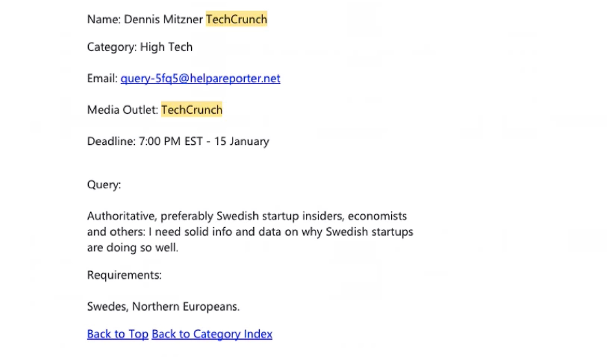

# Notes: Getting Media Coverage for Your App

## 1. Use HARO (Help A Reporter Out)

* **HARO (HelpAReporter.com)** connects journalists with expert sources.
* Journalists from major publications (e.g., **HuffPost**, **TechCrunch**) post requests for expert comments.
* Subscribers receive **2–3 emails daily** containing journalist requests from around the world.

  

## 2. Challenge with HARO

* Daily emails are very long (around **2,000 words** each).
* Reading every email is time-consuming, especially for startup founders.

## 3. Gmail Filtering Trick

To save time:

1. Sign up for HARO using a **Gmail** account.
2. Go to **Settings → Filters and Blocked Addresses → Create a new filter**.
3. Set the **From** field to:

   * `haro@helpareporter.com`
4. Use the **"Doesn't have"** field with your desired keyword (e.g., *coffee*, *babies*, or a publication like *TechCrunch*).
5. Create the filter and choose to **delete emails that don't contain your keyword**.

**Benefit:**

* Only relevant HARO emails reach your inbox.
* Saves time by filtering out unrelated journalist requests.

## 4. Alternative Services

* **JournoRequest.com** – Another platform for journalist requests.
* **Response Source**

  * Mainly for **UK-based** users.
  * Offers a **7-day free trial**.
  * Paid plans can be expensive.
  * Provides better filtering and instant request notifications.

**Recommendation:**

* Monitor all three services for journalist opportunities related to your app's niche.

## 5. Last Resort: App Giveaway

If you can't get media coverage:

* Offer **100–500 free copies** of your paid app to a tech blog.
* Benefits:

  * Easy for journalists to write a short post.
  * Provides value to their readers.
  * Can help your app gain exposure on major tech blogs.

## Key Takeaways

* Use **HARO** to connect with journalists.
* Automate HARO emails with **Gmail filters** to save time.
* Also monitor **JournoRequest** and **Response Source**.
* If media outreach fails, run an **app giveaway** to attract coverage.
