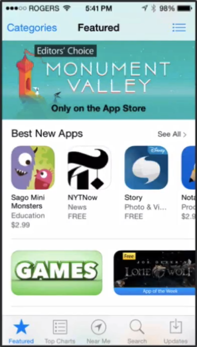

# Notes: "Only on the App Store" Strategy

* **"Only on the App Store"** is a promotional label frequently used on featured apps in the **Apple App Store**.
* It indicates that the app is **exclusive to Apple's platform** (not available on Android or other platforms).
* Apple App Store editors tend to **favor high-quality apps that are exclusive to iOS** when selecting apps for featuring.
* During the featuring process, Apple may ask developers:

  * **"Are you exclusive to the Apple App Store?"**
  * Being able to answer **"Yes"** can improve the chances of getting featured.

  

* Because of this incentive, many developers—especially **game developers**—choose to:

  1. Develop and launch on **iOS first**.
  2. Release the **Android version later** (sometimes months or even years later).
* This explains why Android users often receive some apps much later than iPhone users.
* **Key takeaway:** If deciding whether to build for **iOS or Android first**, the potential advantage of **Apple App Store exclusivity and featuring opportunities** is an important factor to consider.
