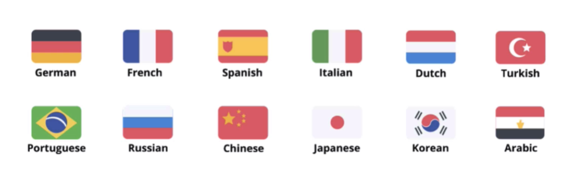

# Notes: How to Increase the Chances of Getting Featured on App Stores

## 1. Localization

* Translate your app's text, screenshots, and other visible content into multiple languages.
* Localization helps your app reach global audiences and increases the chances of being featured.
* **Recommended minimum languages:**

  * Chinese
  * Japanese
  * German
  * French
  * Spanish
  * Italian
* These languages cover some of the largest-performing app stores.

  

---

## 2. Focus on Great Design

* High-quality **UI (User Interface)** and **UX (User Experience)** are essential.
* Consider hiring professional UI/UX designers if you want your app to compete for featuring.
* Design is especially important for the **Apple App Store**.
* Even a highly functional app may not be featured if it looks unattractive.

---

## 3. Generate Buzz Before Launch

* Strong publicity can attract the attention of Apple and Google.
* Build excitement through:

  * Social media
  * Marketing campaigns
  * Word of mouth
* Popular apps with lots of downloads and public interest are more likely to be featured without directly applying.

---

## 4. Build Human Connections

* Personal networking can improve your chances of getting featured.
* Pitch your app directly to App Store managers if you believe it's feature-worthy.
* Good places to meet them include:

  * **Google I/O**
  * **WWDC (Apple Worldwide Developers Conference)**
* Real-life relationships and networking can be more effective than technical optimization alone.

---

## Key Takeaways

* ✔ Localize your app for major global markets.
* ✔ Invest in excellent UI/UX design.
* ✔ Create strong marketing buzz before launch.
* ✔ Network with App Store representatives and pitch your app directly.
* ✔ Combining quality, popularity, and personal connections gives the best chance of being featured.
