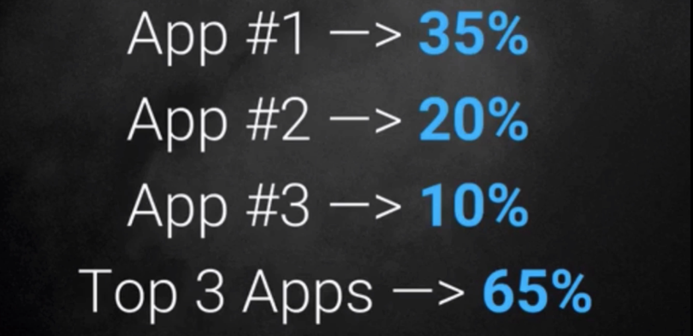

# Notes: App Store Optimization (ASO)

## What is ASO?

* **App Store Optimization (ASO)** is the process of improving an app's visibility in an app store.
* It is similar to **Search Engine Optimization (SEO)**, which helps websites rank higher in search engine results.

### Why is ASO Important?

* ASO is becoming increasingly important as competition in app stores grows.
* The goal is to make your app appear at the top of search results for relevant keywords.

### Key Statistics

* The **top 5 apps** in App Store search results receive **72% of all downloads**.
* The **#1 app alone** receives **35% of all downloads**.
* Apps ranked **below the 25th position** have very little chance of being discovered or downloaded.

  

---

## Goal of ASO

* Improve your app's ranking for targeted keywords.
* Increase app visibility and downloads.
* Compete with top-ranking apps (e.g., *Clumsy Ninja*, *NinJump*).

---

## Key Takeaway

* **ASO is both a science and an art**—it involves optimizing different aspects of an app so it ranks higher in app store search results, leading to significantly more downloads.
