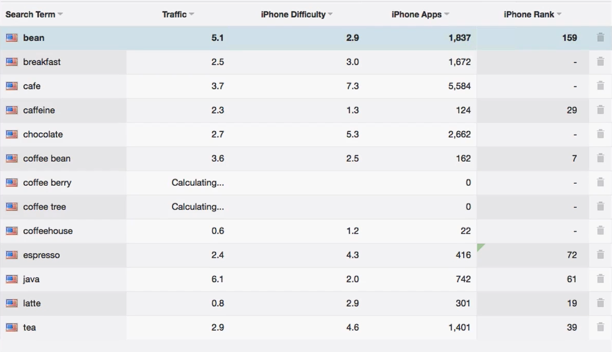

# Notes: App Store Keyword Research Workflow (ASO)

## 1. Start with App Store Search Suggestions

* Open the **App Store** and use the **Search** tab.
* Type a relevant word (e.g., "Ninja").
* Review the **autocomplete suggestions**.
* These suggestions reflect what users actually search for and can provide good keyword ideas.
* **Pros:** Easy, fast, and requires minimal effort.

---

## 2. Use a Reverse Dictionary

* Visit **OneLook (onelook.com)**.
* Use the **Reverse Dictionary**, **not** the standard dictionary or thesaurus.
* **Difference:**

  * **Thesaurus:** Gives synonyms.
  * **Reverse Dictionary:** Gives words commonly associated with your keyword.
* Example:

  * Search **"coffee"** → Results include: Java, espresso, latte, coffee bean, tea, chocolate, etc.
* These associated words often make excellent ASO keywords.

---

## 3. Filter Irrelevant Keywords

* Not every suggested word is useful.
* Remove keywords that are:

  * Rarely searched
  * Irrelevant to your app
* Focus on keywords with real search potential.

---

## 4. Analyze Keywords with ASO Tools

Popular tools:

* **Sensor Tower** (recommended)
* **App Annie**
* Other ASO keyword research tools

In Sensor Tower:

* Go to **Products → App Store Optimization**.
* Paste your keyword list.
* Track keyword performance.

---

## 5. Speed Up Keyword Collection

Instead of copying words one by one:

* Install the free Chrome extension **Code Scraper**.
* Highlight one keyword.
* Right-click → **Scrape Similar**.
* Copy all extracted keywords.
* Paste them into your ASO tool.
* Clean the list:

  * Add commas.
  * Remove irrelevant words.

---

## 6. Evaluate Keyword Metrics

### Traffic

* Estimates how many people search for a keyword.
* **Higher traffic = More searches.**

### Difficulty

* Measures how competitive the keyword is.
* **Higher difficulty = Harder to rank.**

  

---

## 7. Find the "Sweet Spot"

According to the speaker (using Sensor Tower):

* **Traffic score > 3**
* **Difficulty score < 3**

These keywords offer a good balance between demand and competition.

---

## 8. Organize Your Keywords

* Store selected keywords in:

  * Excel
  * Google Sheets
* Build a list of **100–150 keywords**.
* Sort them by quality.
* Choose the strongest keywords for the **100-character App Store keyword field**.

---

## Workflow Summary

1. Get keyword ideas from App Store search suggestions.
2. Expand ideas using OneLook Reverse Dictionary.
3. Remove weak or irrelevant keywords.
4. Analyze keywords using Sensor Tower or App Annie.
5. Check **Traffic** and **Difficulty** metrics.
6. Save and organize keywords in a spreadsheet.
7. Select the best keywords for your App Store listing.

---

## Key Takeaways

* Start with real user search suggestions.
* Use a reverse dictionary to discover related terms.
* Prioritize **high-traffic, low-difficulty** keywords.
* Keep a structured keyword database.
* You can perform effective ASO keyword research yourself instead of hiring an ASO expert.
