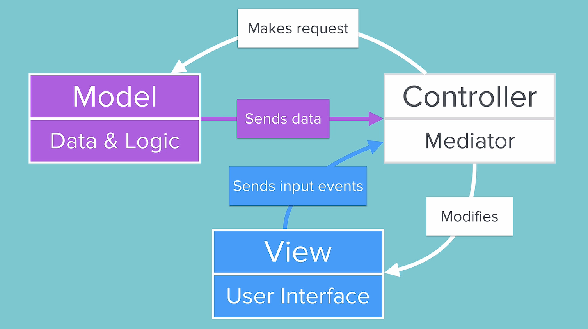

## Notes: Design Patterns & MVC (Model–View–Controller)

### Why the Current Code Structure Is a Problem

* All app logic is stored in a single file (`ViewController.swift`).
* As the app grows, the file becomes:

  * Harder to navigate.
  * More difficult to understand and maintain.
  * More prone to errors.
* A good test of code quality: **Would you still understand the code after not seeing it for 3 months?**

### What Is a Design Pattern?

* A **design pattern** is a **proven solution to a common problem** in software development.
* The main problem design patterns solve is **complexity**.
* They help developers:

  * Organize code.
  * Improve structure.
  * Make applications easier to maintain and scale.

### Understanding Complexity

* Managing a simple project is easy, but larger projects become difficult without organization.
* Adding more code alone does not solve complexity.
* Just as businesses use organizational charts, software needs a clear structure where each component has a specific responsibility.

### Different Design Patterns

* There are many design patterns (e.g., MVC, MVVM, VIPER).
* No single design pattern is universally the best.
* The right pattern depends on:

  * The app's requirements.
  * Developer preferences.
  * Desired balance between readability, simplicity, and maintainability.

### MVC (Model–View–Controller)

MVC is the fundamental design pattern used in many mobile apps and is the pattern traditionally favored by Apple.

#### 1. Model (M)

Responsible for:

* Data storage.
* Business logic.
* Data processing and manipulation.

#### 2. View (V)

Responsible for:

* User Interface (UI).
* Displaying information.
* Handling user interactions.

#### 3. Controller (C)

Acts as the mediator between Model and View.

* Receives user actions from the View.
* Requests data from the Model.
* Processes the Model's response.
* Updates the View with relevant information.

### MVC Workflow

    

1. User interacts with the UI (View).
2. View sends events to the Controller.
3. Controller requests data or actions from the Model.
4. Model processes data and returns results.
5. Controller updates the View.
6. **Model and View never communicate directly**—all communication goes through the Controller.

### Benefits of MVC

* **Separation of concerns**: Each component has a clear responsibility.
* **Code reusability**: Components can be reused in different versions of an app.
* **Modularity**: Easier to replace or update individual parts.
* **Reduced errors**: Better organization leads to fewer mistakes.
* **Maintainability**: Code is easier to understand and modify.
* **Scalability**: Supports larger and more complex applications.

### Example Advantage

If a quiz app needs:

* New languages (German, French).
* Different subjects (History, Science, Humanities).

With MVC:

* Mostly the **Model** needs to change (data and logic).
* The **View** and **Controller** can often remain unchanged.
* This saves time and reduces development effort.

### Key Takeaway

**MVC separates an application into Model, View, and Controller components, making code more organized, reusable, maintainable, and easier to scale as applications grow.**
