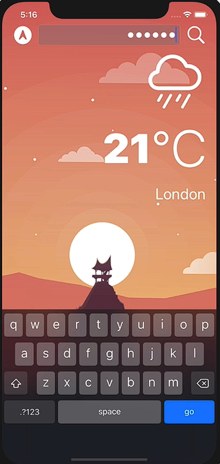

# Notes: UITextField

## What is UITextField?

* A **UITextField** allows users to enter text using the iPhone keyboard.
* Added from the **Object Library** in Interface Builder.
* Automatically supports **Light Mode** and **Dark Mode**:

  * Text color changes automatically.
  * Background adjusts based on interface style.

---

## Configuring UITextField

### Text Input Traits

You can customize how the keyboard behaves:

* **Capitalization**

  * Example: "Words" capitalizes the first letter of each word (e.g., London).

* **Keyboard Type**

  * Default keyboard
  * Number Pad
  * Email Address
  * Twitter keyboard, etc.

* **Return Key**

  * Default = "Return"
  * Can be changed to "Go", "Search", "Done", etc.

* **Secure Text Entry**

  * Used for password fields.
  * Characters appear hidden (••••••).

<p align="center">
    
</p

---

## Connecting UITextField to Code

### IBOutlet

Create an outlet for the text field:

```swift
@IBOutlet weak var searchTextField: UITextField!
```

### IBAction

Create an action for the search button:

```swift
@IBAction func searchPressed(_ sender: UIButton) {
    
}
```

---

## Getting User Input

The user's text is stored in:

```swift
searchTextField.text
```

### Important

* `text` is an **Optional String (`String?`)**
* May be `nil` or empty.

Example:

```swift
print(searchTextField.text!)
```

---

## Placeholder vs Text

### Placeholder

* Light gray hint text.
* Guides users on what to enter.

Example:

```text
Search
Enter city name
Password
```

### Text

* Actual content typed by the user.

```swift
searchTextField.text
```

---

# UITextFieldDelegate

To detect keyboard events (e.g., pressing Return/Go), use a delegate.

### Step 1: Conform to UITextFieldDelegate

```swift
class WeatherViewController: UIViewController, UITextFieldDelegate
```

### Step 2: Set the Delegate

Inside `viewDidLoad()`:

```swift
searchTextField.delegate = self
```

This allows the text field to notify the view controller about user actions.

---

# Delegate Pattern

The text field communicates with its delegate:

Examples:

* User started typing.
* User stopped typing.
* User pressed Return.
* User tapped elsewhere.

The view controller decides how to respond.

---

# Handling the Return (Go) Button

### textFieldShouldReturn

Called when the keyboard's Return/Go button is pressed.

```swift
func textFieldShouldReturn(_ textField: UITextField) -> Bool {
    print(searchTextField.text!)
    return true
}
```

### Purpose

* Acts like an IBAction for the keyboard Return key.
* Allows access to user input.
* Must return a Boolean:

  * `true` → allow Return action.
  * `false` → block Return action.

---

# Dismissing the Keyboard

To hide the keyboard:

```swift
searchTextField.endEditing(true)
```

Use it inside:

### Search Button

```swift
@IBAction func searchPressed(_ sender: UIButton) {
    searchTextField.endEditing(true)
}
```

### Return Key

```swift
func textFieldShouldReturn(_ textField: UITextField) -> Bool {
    searchTextField.endEditing(true)
    return true
}
```

---

# Detecting End of Editing

### textFieldDidEndEditing

Called when editing finishes.

```swift
func textFieldDidEndEditing(_ textField: UITextField) {
    
}
```

### Example: Clear Text Field

```swift
func textFieldDidEndEditing(_ textField: UITextField) {
    searchTextField.text = ""
}
```

Benefits:

* Clears the field after a search.
* Avoids duplicate code in multiple places.

---

# Validating User Input

### textFieldShouldEndEditing

Called before editing ends.

```swift
func textFieldShouldEndEditing(_ textField: UITextField) -> Bool {
    
}
```

Used for validation.

### Example

```swift
func textFieldShouldEndEditing(_ textField: UITextField) -> Bool {
    
    if textField.text != "" {
        return true
    } else {
        textField.placeholder = "Type something"
        return false
    }
}
```

### Result

If the text field is empty:

* Keyboard stays open.
* Editing does not end.
* User sees a reminder message.

---

# Understanding "Should" Methods

Methods containing **"Should"** ask for permission.

Examples:

```swift
textFieldShouldReturn()
textFieldShouldEndEditing()
```

They expect:

```swift
true
```

or

```swift
false
```

to determine whether the action should proceed.

---

# Why Use the `textField` Parameter?

Example:

```swift
func textFieldShouldEndEditing(_ textField: UITextField)
```

The `textField` parameter refers to the specific text field that triggered the event.

Useful when:

* Multiple text fields share the same delegate.
* Different validation is needed for different fields.

---

# Weather App Workflow

### Search Button

1. User enters city name.
2. Presses Search.
3. Keyboard dismisses.
4. Text validated.
5. Weather request can be made.
6. Text field clears.

### Go Button

1. User enters city name.
2. Presses Go.
3. `textFieldShouldReturn()` runs.
4. Keyboard dismisses.
5. Weather request can be made.
6. Text field clears.

---

# Key Delegate Methods

| Method                            | Purpose                            |
| --------------------------------- | ---------------------------------- |
| `textFieldShouldReturn()`         | Detect Return/Go button press      |
| `textFieldShouldEndEditing()`     | Validate before editing ends       |
| `textFieldDidEndEditing()`        | Perform actions after editing ends |
| `searchTextField.delegate = self` | Connect text field to delegate     |

---

# Key Takeaways

* **UITextField** collects user input through the keyboard.
* Customize keyboard behavior using **Text Input Traits**.
* Use **IBOutlet** to access the text field.
* Access user input with `searchTextField.text`.
* Use **UITextFieldDelegate** to respond to keyboard events.
* `textFieldShouldReturn()` handles the Go/Return key.
* `textFieldShouldEndEditing()` is ideal for input validation.
* `textFieldDidEndEditing()` is useful for clearing fields and triggering actions.
* Delegate methods enable communication between the text field and the view controller.
* In the weather app, the best place to start fetching weather data is inside:

```swift
func textFieldDidEndEditing(_ textField: UITextField)
```

because editing has successfully completed and the city name is available.
